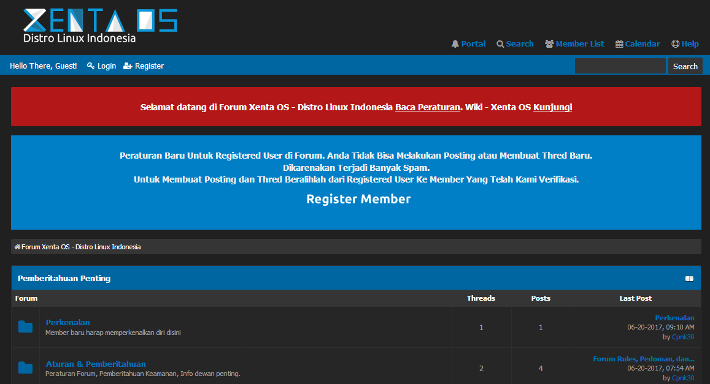
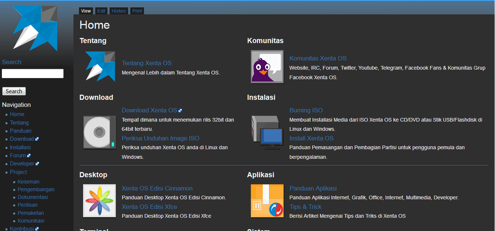
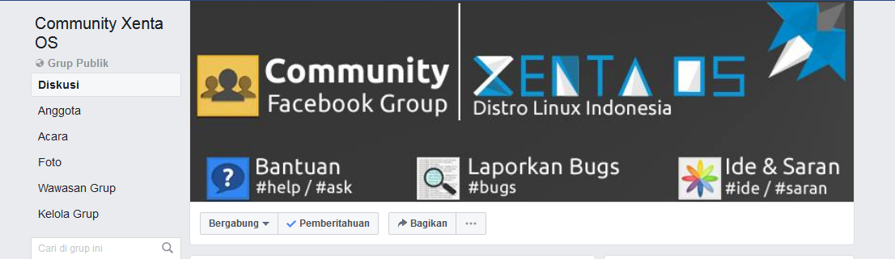
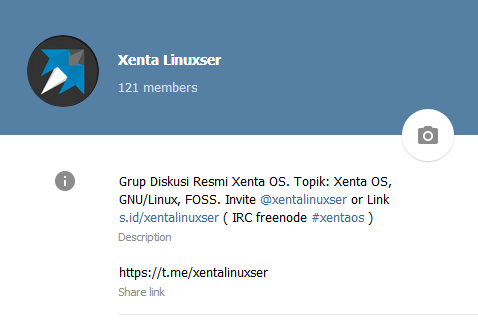
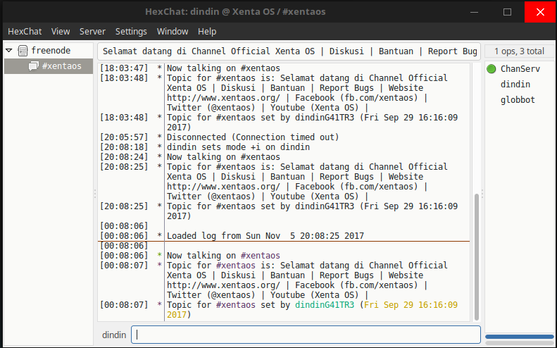
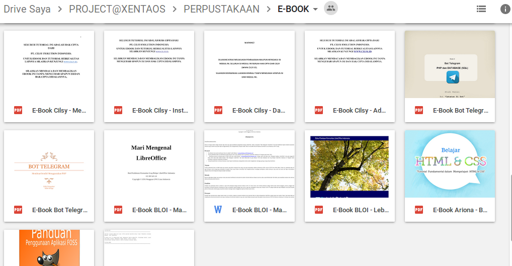

## Dukungan {#dukungan}

Xenta OS memberikan dukungan terhadap pengguna kami secara gratis. Baik Melalui E-Book Panduan, forum, wiki, diskusi chat telegram dan lain lain sebagai berikut :

### Forum Komunitas {#forum-komunitas}

Xenta OS menyediakan forum sebagai wadah dalam berdiskusi, berbagi informasi dalam mengatasi permasalahan yang dialami dan Membahas topik yang berkaitan GNU/Linux. Kunjungi Forum Resmi Xenta OS di :

[http://forum.xentaos.org/](http://forum.xentaos.org/)

### Wiki Panduan {#wiki-panduan}

Xenta OS menyediakan wiki sebagai media belajar secara otodidak atau sebagai panduan dasar mengenal Linux. Kunjungi Wiki Resmi Xenta OS di :

[http://](http://wiki.xentaos.org/)[wiki](http://wiki.xentaos.org/)[.xentaos.org/](http://wiki.xentaos.org/)

### Facebook Group Diskusi {#facebook-group-diskusi}

Xenta OS menyediakan wadah dalam berdiskusi santai seputar sesama pengguna Xenta OS dan Berdiskusi seru yang berkaitan dengan GNU/Linux. Silahkan Bergabung dalam sebuah Komunitas Xenta OS di grup facebook. Gabung di :

[**https://facebook.com/groups/communityxentaos**](https://facebook.com/groups/communityxentaos)

### Telegram Group Chat {#telegram-group-chat}

Xenta OS menyediakan group chat telegram sebagai grup diskusi resmi. Membahas Topik Berkaitan dengan Xenta OS, GNU/Linux, FOSS. Dalam Group mengadakan Kulgram (Kuliah Telegram) Gratis, Topiknya “Berkarya dan Berkreatifitas” .

Invite Link : [**t.me/xentalinuxser**](http://t.me/xentalinuxser)

### IRC Group Chat {#irc-group-chat}

Xenta OS menyediakan group chat IRC sebagai grup diskusi resmi. Membahas Topik Berkaitan dengan Xenta OS, GNU/Linux, FOSS.

Silahkan Gabung di IRC Chat , Melalui Aplikasi IRC Hexchat Sudah Disediakan dalam bawaaan Perangkat Lunak Xenta OS.

| Server | Channel |
| --- | --- |
| irc.freenode.net | #xentao |

### Perpustakaan E-Book {#perpustakaan-e-book}

[http://s.id/perpustakaanxentaos](http://s.id/perpustakaanxentaos)