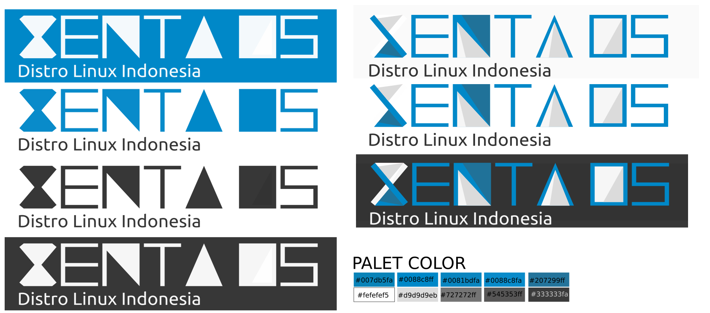
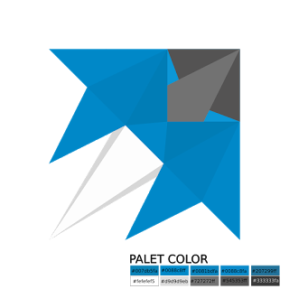
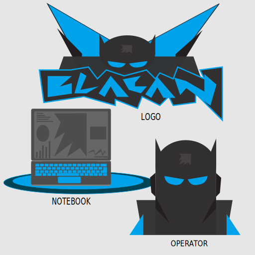
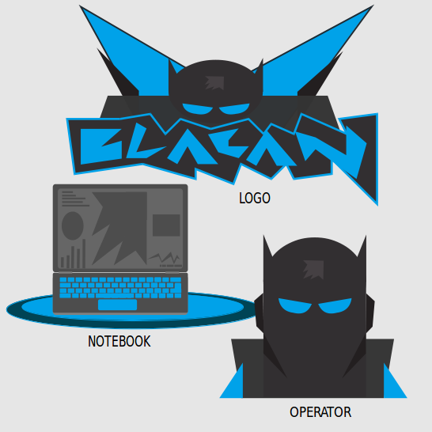

## Merk {#merk}

### Logotype {#logotype}

[**Logo**](https://id.wikipedia.org/wiki/Logo) merupakan suatu gambar atau sekadar sketsa dengan arti tertentu, dan mewakili suatu arti dari perusahaan, daerah, organisasi, produk, negara, lembaga, dan hal lainnya membutuhkan sesuatu yang singkat dan mudah diingat sebagai pengganti dari nama sebenarnya.

Xenta OS Memiliki Logo lebih tepatnya **logotype.**

Hanya Huruf E, T dan S yang default font. dan XNAO didesign .

### Maskot {#maskot}

**Maskot** adalah bentuk atau benda yang dapat berbentuk seseorang, binatang, atau objek lainnya yang dianggap dapat membawa keberuntungan dan untuk menyemarakkan suasana acara yang diadakan. ... Setiap **maskot** yang dibuat akan diberikan nama panggilan yang sesuai dengan karakter dari **maskot** itu sendiri.

Maskot Xenta OS :

Maskot Pertama (Project X7 OS)

Maskot Pertama (Project X7 OS) Sekilas Mirip Layang Layang dan didesign secara sederhana.

Maskot Saat ini Xenta OS

Maskot Saat ini Xenta OS Sekilas Mirip Pesawat terbang. dan memang benar ini pesawat terbang ? dan kenapa harus pesawat terbang ? xenta memiliki impian agar menjadi distro linux indonesia yang bisa terbang tinggi seperti pesawat dan terbang bebas seperti rasa ingin tahu yang tak terbatas.

### Hero {#hero}

Hero adalah sebuah kartun fiksi karya Xenta OS di setiap Versi Kode Nama Xenta OS LTS . [Baca Cerpennya…](http://www.xentaos.org/2017/09/cerita-fiksi--hero-xenta-os-arok.html)

Hero Rilis : “Arok”

Hero Developer : “Blacan”