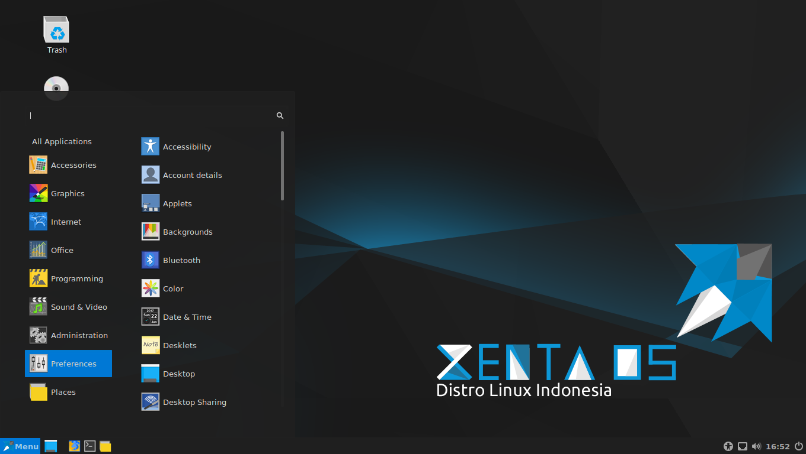
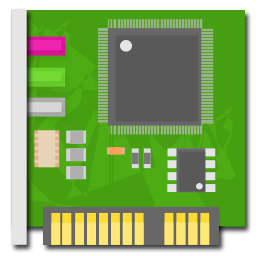
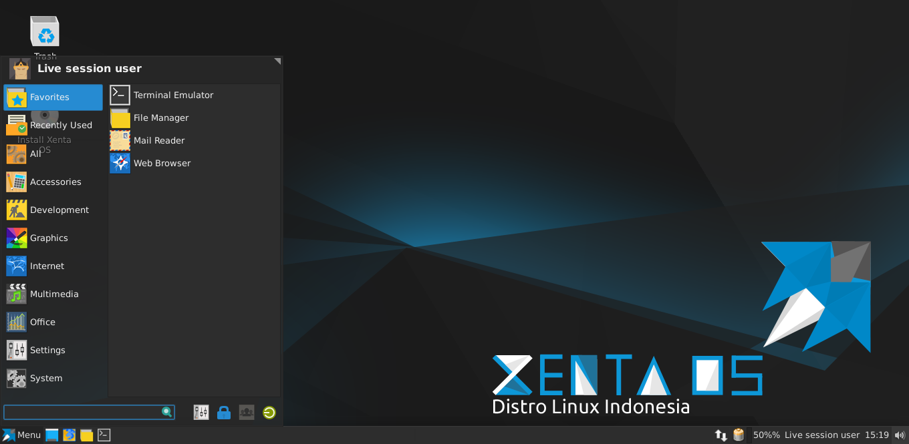

## Perilisan {#perilisan}

### Kode Nama {#kode-nama}

Kode Nama di Xenta OS selalu menggunakan nama raja raja dalam sejarah indonesia, alternatifnya menggunakan nam kota di indonesia. Kode Nama selalu Berurutan sesuai urutan abjad dan huruf pertama dari nama kode sesuai dengan indeks nomor versi dalam alfabet. kode nama pertama di mulai dar Arok.

| No | Kode Nama | Nomer Versi | Publikasi |
| --- | --- | --- | --- |
| 1. | -Alpha | 1.1 | Tidak Dipublikasikan |
| 2. | -Betha | 1.2 | Tidak Dipublikasikan |
| 3. | Arok | 1.3 | Di Publikasikan Diambil dari Nama Raja Ken Arok |
| 4. |  |  |  |

### Nomer Versi {#nomer-versi}

Nomer Versi di Xenta OS terdiri 2 Nomer dengan dipisahkan batas “. LTS”.

Nomer Based Xenta OS di Mulai dari Linux Mint Versi 18.1 didalam Kode Based Xenta di sebut &quot;1&quot;. Pertama Karena Xenta OS memulai dari Versi Linux Mint 18.1.

| Based Linux Mint | (X) Nomer Linux Mint di Xenta OS | (Y) Nomer Rilis Xenta OS |
| --- | --- | --- |
| 18.1 | 1 | -Alpha |
| 18.1 | 1 | -Betha |
| 18.1 | 1 | Arok |
|  |  |  |

Rumus Penulisan Rilis :X.Y LTS

X = Nomer Linux Mint di Xenta

Y = Nomer Rilis Xenta OS

Nama OS + Nomer Versi+ LTS + Kode Nama + Desktop Envirotment + Architectur

Contoh :

Xenta OS 1.3 LTS &quot;Arok&quot; Cinnamon amd64

| Nama OS | Nomer Versi | Kode Nama | Desktop Envirotment | Architectur |
| --- | --- | --- | --- | --- |
| Xenta OS | 1.3 LTS | Arok | Cinnamon | amd64 |

### Edisi {#edisi}

#### Cinnamon 64Bit {#cinnamon-64bit}

Xenta OS memfokuskan dan mengembangkan racikan Desktop Cinnamons Edisi di architectur 64 bit. ditargetkan untuk Komputer Desktop dan Laptop

Minimal spesifikasi yang dibutuhkan :

*   Memory Minimal RAM 2 GB DDR3/DDR4

*   Prosesor Minimal Dual Core 2.0 GHz

*   OnBoard Video Grafis

    *   Direkomendasikan Video Grafis / GPU 2 GB DDR3

*   Hardisk Minimal Memiliki Kapastitas 16 Gb

#### XFCE 32Bit {#xfce-32bit}

Xenta OS memfokuskan dan mengembangkan racikan Desktop XFCE Edisi di architectur 32 bit. ditargetkan untuk Komputer Desktop dan Notebook.

Minimal spesifikasi yang dibutuhkan :

*   Prosesor Minimal Pentium 4 2.0 GHz

*   Memory Minimal RAM 1 GB DDR/DDR2

*   OnBoard Video Grafis

    *   Video Grafis / GPU Minimal 512 Mb DDR/DDR2

*   Hardisk Minimal Memiliki Kapastitas 16 Gb