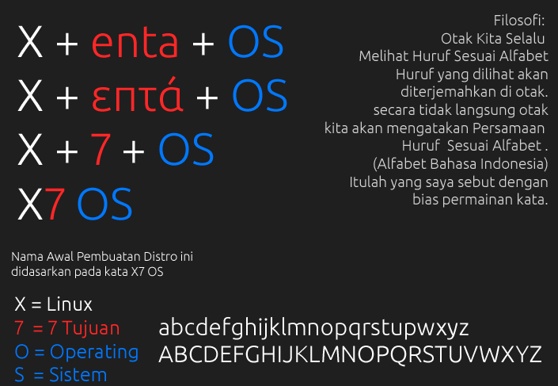

## Tentang {#tentang}

### Latar Belakang {#latar-belakang}

Xenta OS dilatar belakangi oleh proyek sebuah Icons Theme yang di buat oleh Dindin Hernawan Sebagai Project hobbie. yang di publikasi ke situs [opendesktop.org](https://www.opendesktop.org/p/1168836/) pertama kali pada tanggal 24 Januari 2017\. Dari Proyek Icons tersebut dikembangkan menjadi sebuah proyek sistem operasi yang dinamakan proyek X7 OS .

### Sejarah Proyek {#sejarah-proyek}

Gambar 2.1: Dindin Hernawan

Dindin Hernawan adalah pengguan setia Linux Mintsejak Masih Sekolah SMK di Sekolah Swasta SMK AL-AZHAR Citangkolo Kota Banjar.

Mengenal Linux Mint Pertamakali duduk dibangku Kelas I SMK. Waktu itu diberi majalah PC MEDIA yang berisi Review dari Distro Linux Mint. Sejak Saat itu Mempelajari GNU/Linux.

Xenta OS juga dilatar belakangi oleh Cita Cita Dindin Hernawan yaitu Meracik sebuah sistem operasi Distribusi (Distro) GNU/Linux sendiri. Terbatasnya Informasi dalam teknik membuat Distro GNU/Linux atau sering Disebut Remastering. Dengan hobie dan pengalamannya Dindin Hernawan berhasil mengembangkan sebuah Teknik Remastering yang dikembangkan dari 2 panduan :

*   [**http://www.915tx.com/**](http://www.915tx.com/)

    *   [http://www.915tx.com/remaster/](http://www.915tx.com/remaster/)

*   [**http://willhaley.com/**](http://willhaley.com/)

    *   [http://willhaley.com/blog/create-a-custom-debian-stretch-live-environment-ubuntu-17-zesty](http://willhaley.com/blog/create-a-custom-debian-stretch-live-environment-ubuntu-17-zesty)

    Dindin Hernawan juga menerbitkan sebuah panduan remasteringnya yang Bisa diunduh di Repository Xenta OS. [http://repository.xentaos.org/](http://repository.xentaos.org/)

    Github : [https://github.com/dindinG41TR3/panduan-remastering](https://github.com/dindinG41TR3/panduan-remastering)

Sejak Rilis Versi 1.3 LTS Sudah tak lagi meremaster Linux Mint dan Membuat sebuah Repository sendiri yang dikelola di Github : [https://github.com/xentaos](https://github.com/xentaos) semua paketnya merupakan hasil pengembangan dari paket induk Linux Mint yang dimodifikasi dan dibuat Penyesuaian untuk Xenta OS. Metode Membuat nya menggunakan Tenknik Debootsrap . Bisa dicek Panduannya ada di Github [https://github.com/dindinG41TR3/panduan-debootstraping](https://github.com/dindinG41TR3/panduan-debootstraping) .

### Asal Usul Nama {#asal-usul-nama}

Xenta OS berasal dari kata X dan επτά (bahasa yunani yang artinya tujuh) x sendiri melambangkan untuk OS bertipe Linux, dan επτά diplesetkan menjadi kata enta meskipun itu beda artinya. sebagai bias dari permainan kata. Tujuh itu melambangkan Tujuan.

