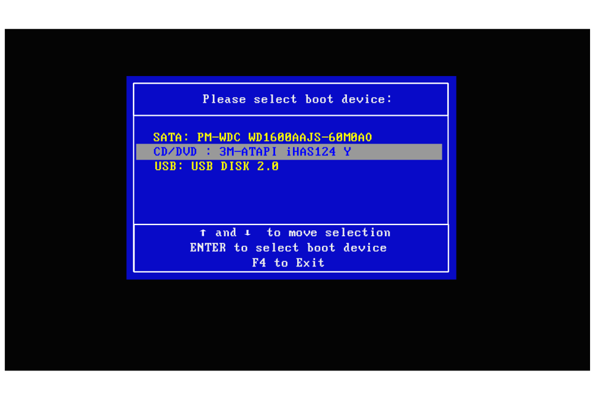
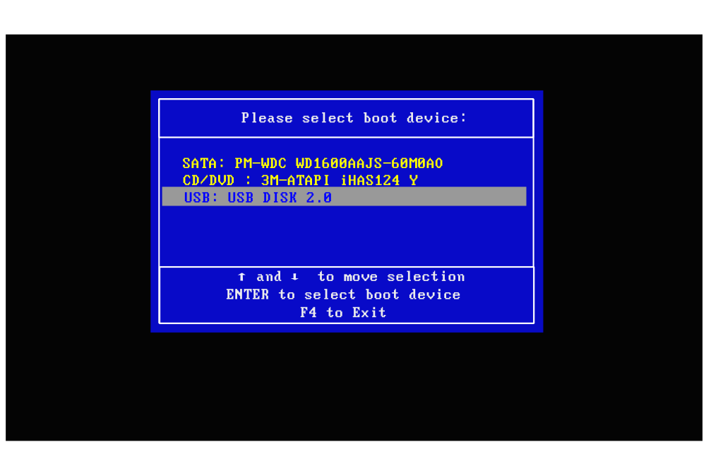

## Booting First Device Melalui Booting Menu {#booting-first-device-melalui-booting-menu}

Langkah Langkah Mengatur First Booting Device Menu :

1.  Terlebih dahulu Menyalakan Komputer / Notebook / Laptop .

2.  Segera Tekan Terus Tombol “**F7**” / “**F8**” / “**F11**” Tekan Terus Ketiga Tombool Itu. Sampai Muncul Tampilan BIOS Setup. _(__F8_ _dan_ _F11_ _Untuk Berjaga Jaga Saja Jika AMI BIOS Masuknya Pakai Kedua Tombol Key Tersebut )_

3.  Tampilan First Booting Device Menu AMI BIOS

Dibawah Ini Untuk Booting Jika dari Media DVD Bootable

Silahkan Pilih* “**CD/DVD :** ” dan Tekan Tombol Enter

*Untuk Navigasinya Pakai Tombol Arah

Keterangan :

Dibawah Ini Untuk Booting Jika dari Media USB Bootable

Silahkan Pilih* “**USB :** ” dan Tekan Tombol Enter

*Untuk Navigasinya Pakai Tombol Arah

Keterangan :