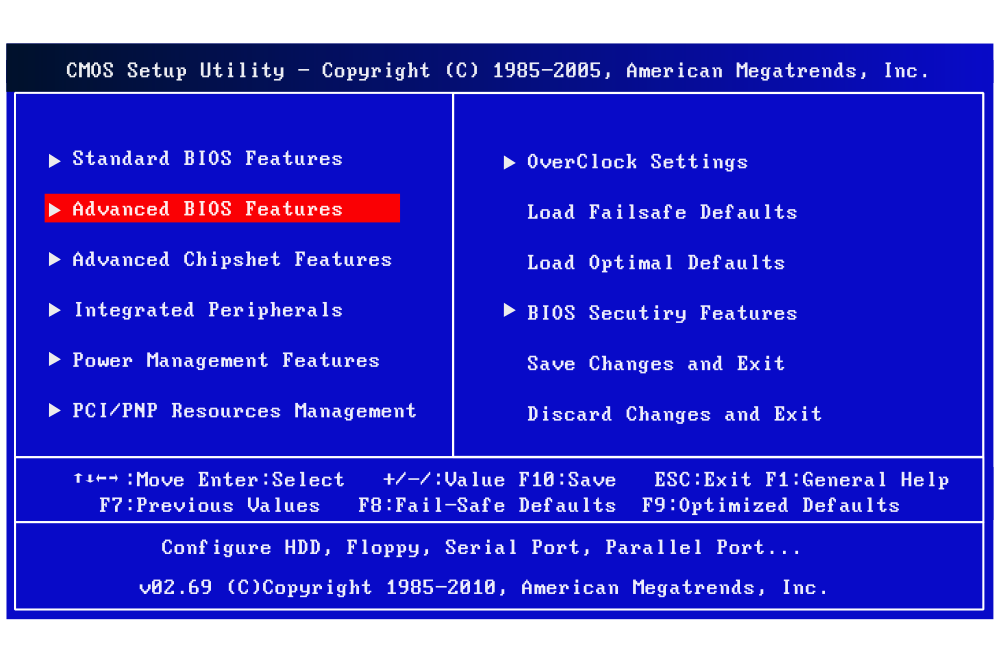

## Konfigurasi BIOS {#konfigurasi-bios}

### Booting First Device (BIOS Legacy) {#booting-first-device-bios-legacy}

Pada Dasarnya semua BIOS Komputer memiliki konfigurasi Booting First Device yang sama hanya saja langkah langkahnya berbeda beda sesuai dengan merk BIOS dari Komputer /Laptop / Notebook Tersebut. Diantaranya Terdapat 3 Brand BIOS Populer yaitu AMI BIOS, AWARD BIOS dan PHOENIX BIOS. Ketiga BIOS tersebut adalah BIOS yang sering ditemui di Motherboard dan Komputer Lama Generasi 2000an.

TIPS :

*   Menentukan BIOS Setup First Boot Carilah Pengaturan BIOS konfirgurasi atau Tab BIOS Boot. Silahkan Cari dan Jelajah saja dan cari Bios Firstnya.

*   Untuk Motherboard Silahkan Download Buku Manualnya di Webiste Resminya. Biasanya Menyertakan.

Panduan ini Menyertakan Pengaturan Untuk AMI BIOS, AWARD BIOS dan PHOENIX BIOS.

#### Mengatur BIOS Legacy First Booting Device {#mengatur-bios-legacy-first-booting-device}

##### Di AMI BIOS {#di-ami-bios}

AMI BIOS adalah BIOS yang dikembangkan dan di produksi oleh American Megatrend Inc.

| Merk Motherboard | Masuk AMI BIOS Setup |
| --- | --- |
| CARDEX | DELETE |
| ECS | DELETE |

Langkah Langkah Mengatur BIOS Legacy First Booting Device :

1.  Terlebih dahulu Menyalakan Komputer / Notebook / Laptop .

2.  Segera Tekan Terus Tombol “**DEL****ETE**” / “**F1**” / “**F****2**” Tekan Terus Ketiga Tombool Itu. Sampai Muncul Tampilan BIOS Setup. _(F1 dan F2 Untuk Berjaga Jaga Saja Jika AMI BIOS Masuknya Pakai Kedua Tombol Key Tersebut )_

3.  Tampilan AMI BIOS Utility

    Silahkan Pilih* “**Advanced BIOS Features**” dan Tekan Tombol Enter

    *Untuk Navigasinya Pakai Tombol Arah

Keterangan :

1.  Tampilan AMI BIOS Utility “Advanced BIOS Features”

    Silahkan Pilih* “**Boot Device Priority**” dan Tekan Tombol Enter

    Keterangan :

    *Untuk Navigasinya Pakai Tombol Arah

1.  Tampilan AMI BIOS Utility “Boot Device Priority”

    Silahkan Pilih* “**1st Boot Devices**” dan Tekan Tombol Enter lalau Pilih **CD/DVD : *** jika Sudah Tekan Tombol **“Enter”**

    * CD/DVD : 3M-ATAPI IHAS124 Y adalah nama DVD Devices * nama ini disesuaikan dengan nama DVD rom terpasang di komputer anda. Ciri cirinya adalaha **CD/DVD :** lalu nama perangkat DVDnya

    *Untuk Navigasinya Pakai Tombol Arah

Keterangan :

1.  Tampilan AMI BIOS Utility “Advanced BIOS Features”

    Silahkan Tekan Tombol “**F10**” untuk menyimpan pengaturannya lalu arahkan ke “**[Ok]**” dan tekan tombol Enter

    *Untuk Navigasinya Pakai Tombol Arah

    Keterangan :

2.  Silahkan Restart Kompuert / Laptop / Notebooknya.

SELESAI KONFIGURASI BIOS FIRST BOOT DEVICE AMI BIOS

Selanjutnya adalah Menginstall Xenta OS Terdapat Pilihan Single atau Dual Boot. Panduannya ada di Halaman

**4.3 Memulai Installasi**

##### Di Award BIOS {#di-award-bios}

##### Di Phoenix BIOS {#di-phoenix-bios}

Phoenix BIOS adalah BIOS yang dikembangkan dan di produksi oleh Phoenix BIOS.

| Merk Motherboard | Masuk Phoenix BIOS Setup |
| --- | --- |
| ECS | DELETE |

Langkah Langkah Mengatur BIOS Legacy First Booting Device :

1.  Terlebih dahulu Menyalakan Komputer / Notebook / Laptop .

2.  Segera Tekan Terus Tombol “**DEL****ETE**” / “**F1**” / “**F****2**” Tekan Terus Ketiga Tombool Itu. Sampai Muncul Tampilan BIOS Setup. _(F1 dan F2 Untuk Berjaga Jaga Saja Jika_ _Phoenix_ _BIOS Masuknya Pakai Kedua Tombol Key Tersebut )_

3.  Tampilan Phoenix BIOS Utility

    Silahkan Pilih dan arahkan Ke Tab “**Boot**”

    *Untuk Navigasinya Pakai Tombol Arah

Keterangan :

1.  Tampilan Phoenix BIOS Utility “Boot”

    Silahkan Arahkan Ke “**CD-ROM Drive**” dan Tekan Tombol “**+**” sampai menjadi nomer urutan pertama

    *Untuk Navigasinya Pakai Tombol Arah

    *Untuk Pilhannya gunakan tombol “+” untuk menaikan yang dipilih dan tombol “-” untuk menurunkan yang dipilih

Keterangan :

*Jika sudah seperti digambar dibawah ini berarti sudah benar urutannya

Keterangan :

1.  Tampilan Phoenix BIOS Utility

    Silahkan Tekan Tombol “**F10**” untuk menyimpan pengaturannya lalu arahkan ke “**[****Yes****]**” dan tekan tombol Enter

    *Untuk Navigasinya Pakai Tombol Arah

    Keterangan :

2.  Silahkan Restart Kompuert / Laptop / Notebooknya.

SELESAI KONFIGURASI BIOS FIRST BOOT DEVICE PHOENIX BIOS

Selanjutnya adalah Menginstall Xenta OS Terdapat Pilihan Single atau Dual Boot. Panduannya ada di Halaman

**4.3 Memulai Installasi**