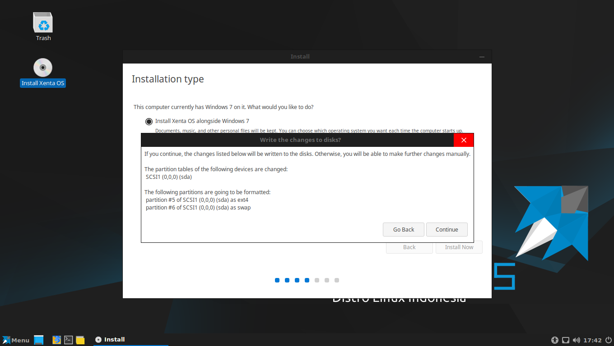

## Memulai Installasi {#memulai-installasi}

Memulai Installasi Xenta OS. Sebelum memasang anda bisa mencobanya dalam mode live langsung dari DVD Bootable atau USB Bootable Media.

Untuk Memasang Xenta OS disesuikan kebutuhan anda bisa memasang Xenta OS secara single os di komputer / notebook / laptop yang disebut (Single Boot).

Jika ingin memasang Berdampingan dengan sistem operasi yang sudah ada di komputer / notebook / laptop dinamakan dual sistem operasi (Dual Boot) tanpa menghilangkan data atau sistem operasi yang sudah tersedia.

Xenta OS juga bisa di install secara virtual dari sistem operasi yang ada (Virtual).

### Single Boot {#single-boot}

Single Boot adalah hanya memasang Sistem operasi Xenta OS di komputer / notebook / laptop.

#### Installasi Single Boot Otomatis (Mudah dan Cepat) {#installasi-single-boot-otomatis-mudah-dan-cepat}

Pilihan Ini Akan Menghapus Apapun di Hardisk Anda dan Hanya Memasang Xenta OS. Jika ada data atau Dokument Sebaiknya di backup kedalam hardisk yang lain (Hardisk External)

Langkah Langkah Pemasangan

Xenta OS Single Boot Otomatis :

1.  Siapkan Terlebih Dahulu Media Bootabel Insttaller Berupa (Media DVD atau USB Bootable Intaller ).

*   *   Tutorial Membuat nya ada di Halaman **3.1.3 Media Bootable**

1.  Nyalakan Komputer komputer / notebook / laptop.

2.  Pasang Media Bootable Ke Komputer.

*   *   Untuk DVD Bootable Masukan ke dalam DVD-ROM

    *   Untuk USB Bootable Tancapkan USB Flasdisk Bootablenya ke Port USB.

1.  Silahkan Atur Biosnya agar Mendeteksi Media Bottablenya menjadi urutan pertama dalam komputer. Lalu Simpan dan Restart PC.

*   *   Tutorialnya Pengaturannya ada di Halaman 3.2 Konfigurasi BIOS

1.  Tunggu sampai Tampil Meminta Booting dari Perangkat Media Silahkan Tekan Enter.

*   Keterangan :

1.  Lalu akan Tampil grub Intaller Xenta OS. **Biarkan saja sampai Selsai Waktu penghitung mundurnya.**

1.  Tampil Splash Booting Xenta OS. **Biarkan saja sampai selesai.**

1.  Tampil Login Screen Xenta OS. **Biarkan saja sampai Selsai Waktu penghitung mundurnya.**

1.  Lalu akan Tampil Desktop Xenta OS. Selanjutnya Klik 2 Kali Icons ini

    Di Desktop “**Install Xenta OS**” .

1.  Jendela Installer Xenta OS menanyakan Bahasa Pemasangan &amp; Bahasa Komputer nantinya.

    Menu untuk Memilih Bahasa Install dan Bahasa yang nantinya dipasang ke Komputer anda. Silahkan Pilih Bahasanya. Tutorial ini adalah Bahasa yang dipilih “Inggris” sebagai bahasanya.

    Jika Ingin Bahsas Indonesia Silahkan Gulir pilihan Bahasanya Sampai Terdapat “**Indonesian**”.

    Jika Sudah Klik **Continue**

1.  Jendela Installer Xenta OS menanyakan Paket Software third party

    _Menu_ _untuk memilih untuk mendownload_ _software third party_ _atau tidak._ _Klik Ceklisnya jika ingin Memasang_ _software third party_ _nya._

    Jika Sudah Klik **Continue**

1.  Jendela Installer Xenta OS menanyakan Jenis Pemasangan Xenta OS.

*   *   Karena anda Memilih **Installasi Single Boot Otomatis** **(Mudah dan Cepat)**

        Silahkan Klik **“Install Now”**

*   Peringatan :

Pilihan Ini Akan Menghapus Apapun di Hardisk Anda dan Hanya Memasang Xenta OS. Jika ada data atau Dokument Sebaiknya di backup kedalam hardisk yang lain (Hardisk External)

1.  Jendela Installer Xenta OS menanyakan Persetujuan Untuk Menginstall.

    Silahkan Klik **“****Contine****”**

1.  Jendela Installer Xenta OS menanyakan Lokasi_._

    Silahkan Cari dan Tentukan Lokasinya dan Klik **“****Continue****”**

    Catatan:

    Untuk Memilih Lokasinya Silahkan Klik Pada Lokasi Mapnya

1.  Jendela Installer Xenta OS menanyakan Keyboard Layout .

    Keyboard Layout pilih English (US) atau biarkan saja.

    Silahkan Klik **“****Continue****”**

    

1.  Jendela Installer Xenta OS menanyakan Data Username, Hostname dan Password yang nantinya di pakai untuk Login Ke Komputer.

    Silahkan Isi datanya Jika Sudah Klik **“****Continue****”**

    

Contoh Pengisisnya :

1.  Jendela Installer Xenta OS Pemasangan ke Kompter.

    Memerlukan Waktu Cukup lama Tergantung Spesifikasi Komputernya.

    Silahkan Tunggu saja sampai selesai

1.  Jendela Installer Xenta OS Pemasangan Selesai.

    Memerlukan Waktu Cukup lama Tergantung Spesifikasi Komputernya.

    Silahkan Pilih dan Klik.

*   *   *   **Continue Testing** “Pilihan ini untuk melanjutkan live pengetesannya”

        *   Restart Now “Pilihan ini untuk merestart komputer”

Pemasangan Telah Berhasil

**Installasi Single Boot Otomatis (Mudah dan Cepat)**

Sudah Selesai

#### Installasi Single Boot Manual (Penjelajahan) {#installasi-single-boot-manual-penjelajahan}

Pilihan Ini Akan Menghapus Apapun di Hardisk Anda dan Hanya Memasang Xenta OS. Jika ada data atau Dokument Sebaiknya di backup kedalam hardisk yang lain (Hardisk External)

Langkah Langkah Pemasangan

Xenta OS Single Boot Otomatis :

1.  Siapkan Terlebih Dahulu Media Bootabel Insttaller Berupa (Media DVD atau USB Bootable Intaller ).

*   *   Tutorial Membuat nya ada di Halaman **3.1.3 Media Bootable**

1.  Nyalakan Komputer komputer / notebook / laptop.

2.  Pasang Media Bootable Ke Komputer.

*   *   Untuk DVD Bootable Masukan ke dalam DVD-ROM

    *   Untuk USB Bootable Tancapkan USB Flasdisk Bootablenya ke Port USB.

1.  Silahkan Atur Biosnya agar Mendeteksi Media Bottablenya menjadi urutan pertama dalam komputer. Lalu Simpan dan Restart PC.

*   *   Tutorialnya Pengaturannya ada di Halaman 3.2 Konfigurasi BIOS

1.  Tunggu sampai Tampil Meminta Booting dari Perangkat Media Silahkan Tekan Enter.

Keterangan :

1.  Lalu akan Tampil grub Intaller Xenta OS. **Biarkan saja sampai Selsai Waktu penghitung mundurnya.**

1.  Tampil Splash Booting Xenta OS. **Biarkan saja sampai selesai.**

1.  Tampil Login Screen Xenta OS. **Biarkan saja sampai Selsai Waktu penghitung mundurnya.**

1.  Lalu akan Tampil Desktop Xenta OS. Selanjutnya Klik 2 Kali Icons ini

    Di Desktop “**Install Xenta OS**” .

1.  Jendela Installer Xenta OS menanyakan Bahasa Pemasangan &amp; Bahasa Komputer nantinya.

    Menu untuk Memilih Bahasa Install dan Bahasa yang nantinya dipasang ke Komputer anda. Silahkan Pilih Bahasanya. Tutorial ini adalah Bahasa yang dipilih “Inggris” sebagai bahasanya.

    Jika Ingin Bahsas Indonesia Silahkan Gulir pilihan Bahasanya Sampai Terdapat “**Indonesian**”.

    Jika Sudah Klik **Continue**

1.  Jendela Installer Xenta OS menanyakan Paket Software third party

    _Menu_ _untuk memilih untuk mendownload_ _software third party_ _atau tidak._ _Klik Ceklisnya jika ingin Memasang_ _software third party_ _nya._

    Jika Sudah Klik **Continue**

1.  Jendela Installer Xenta OS menanyakan Jenis Pemasangan Xenta OS.

*   *   Karena anda Memilih **IInstallasi Single Boot Manual** **(Penjelajahan)**

        Silahkan Klik Centang “**Something else**” dan Klik “**Continue****”**

*   Peringatan :

Pilihan Ini Akan Menghapus Apapun di Hardisk Anda dan Hanya Memasang Xenta OS. Jika ada data atau Dokument Sebaiknya di backup kedalam hardisk yang lain (Hardisk External)

1.  Jendela Installer Xenta OS Penjelajahan.

    Panduan ini Menggunakan Hardisk Kosong dengan Tanpa Partisi Table

    Jika Sudah ada Partisi Tablenya Lewatin Langkah Ini.

    Jika Belum Klik **New Partition Table.** Ciri Cirinya Tidak nampil keterangan free space

    Keterangan :

1.  Muncul Jedela Kecil Meminta Persetujuan Klik Saja “**Continue**”

    Keterangan :

2.  Jendela Installer Xenta OS Membuat Partisiuntuk Systemnya.

    Pertama Adalah Membuat Partisiuntuk Swap.

    klik gambaricons **“****+”** seperti gambar dibawah ini

    Keterangan :

Silahkan Tentukan Ukuran Kapastias Partisi swap

swap ini digunakan supaya nantinya ketika ram kita tidak kuat mengatasi kinerja laptop maka swap ini bisa meringankan Ram kita, swap ini adalah 2x ukuran ram kita Satuannya Megabyte.

2000 Megabyte (MB) = 2 Gigabyte (GB).

Contoh :

Keterangan :

Jika Sudah Klik “**OK**”.

1.  Jendela Installer Xenta OS Membuat Partisiuntuk Systemnya.

    **Kedua** **Adalah** **Membuat Partisi****untuk** **Sistemnya****.**

    klik Partisi “**Free space**” lalu Klik gambaricons **“****+”** seperti gambar dibawah ini

    Keterangan :

1.  Jendela Installer Xenta OS Tampil Jendela Pemartisian

Penjelasan File Sistem ada di Halaman **2.3** **File System****di** **Linux**

Panduan Ini Menggunakan File sistem jenis **ext4**

Silahkan Disi Seperti ini :

Catatan

*   Type for the new partition: silahkan pilih “**Primary**”

*   Location for the new partition: silahkan pilih “**Begining of this space**”

*   Use as : Silahkan Pilih **Ext4**

*   Mount point : Untuk Semua Jenis File Sistem pastikan mount point adalah / (root)

    Lihat Gambar :

Keterangan :

Jika Sudah Klik “**OK**”

*   

1.  Jendela Installer Xenta OS

    Jika sudah membuat Partisi Swap dan Partisi Sistemnya

    Selanjutnya kllik Partisi “**ext4**” dan Cari dan Pilih “**Install now** “

    Keterangan :

1.  Jendela Installer Xenta OS menanyakan Persetujuan Untuk Menginstall.

    Silahkan Klik **“****Contine****”**

Keterangan :

1.  Jendela Installer Xenta OS menanyakan Lokasi_._

    Silahkan Cari dan Tentukan Lokasinya dan Klik **“****Continue****”**

    Catatan:

*   Untuk Memilih Lokasinya Silahkan Klik Pada Lokasi Mapnya

1.  Jendela Installer Xenta OS menanyakan Keyboard Layout .

    Keyboard Layout pilih English (US) atau biarkan saja.

    Silahkan Klik **“****Continue****”**

    

1.  Jendela Installer Xenta OS menanyakan Data Username, Hostname dan Password yang nantinya di pakai untuk Login Ke Komputer.

    Silahkan Isi datanya Jika Sudah Klik **“****Continue****”**

    

Contoh Pengisisnya :

1.  Jendela Installer Xenta OS Pemasangan ke Kompter.

    Memerlukan Waktu Cukup lama Tergantung Spesifikasi Komputernya.

    Silahkan Tunggu saja sampai selesai

1.  Jendela Installer Xenta OS Pemasangan Selesai.

    Memerlukan Waktu Cukup lama Tergantung Spesifikasi Komputernya.

    Silahkan Pilih dan Klik.

*   *   *   **Continue Testing** “Pilihan ini untuk melanjutkan live pengetesannya”

        *   Restart Now “Pilihan ini untuk merestart komputer”

Pemasangan Telah Berhasil

**Installasi Single Boot Manual** **(Penjelajahan)**

Sudah Selesai

### Dual Boot {#dual-boot}

Dual Boot adalah Memasang Sistem operasi Xenta OS di komputer / notebook / laptop bersamaan dengan Sistem Operasi Windows. Paduan ini Dibagi Menjadi Panduan Installasi Dual Boot Otomatis disarankan karena Mudah dan Cepat.

Jika anda ingin Membuat Kapasitas dan Swap Yang Berbeda Gunakan Panduan Installasi Dual Boot Manual. Pada Panduan ini Memerlukan Ketelitian, Minimal Membaca dan Paham pada Basahan **BAB 3.3** **Pengenalan Pemartisian**

#### Installasi Dual Boot Otomatis (Mudah dan Cepat) {#installasi-dual-boot-otomatis-mudah-dan-cepat}

Langkah Langkah Pemasangan

Xenta OS Dual Boot Otomatis :

1.  Siapkan Terlebih Dahulu Media Bootabel Insttaller Berupa (Media DVD atau USB Bootable Intaller ).

*   *   Tutorial Membuat nya ada di Halaman **3.1.3 Media Bootable**

1.  Nyalakan Komputer komputer / notebook / laptop.

2.  Pasang Media Bootable Ke Komputer.

*   *   Untuk DVD Bootable Masukan ke dalam DVD-ROM

    *   Untuk USB Bootable Tancapkan USB Flasdisk Bootablenya ke Port USB.

1.  Silahkan Atur Biosnya agar Mendeteksi Media Bottablenya menjadi urutan pertama dalam komputer. Lalu Simpan dan Restart PC.

*   *   Tutorialnya Pengaturannya ada di Halaman 3.2 Konfigurasi BIOS

1.  Tunggu sampai Tampil Meminta Booting dari Perangkat Media Silahkan Tekan Enter.

*   Keterangan :

1.  Lalu akan Tampil grub Intaller Xenta OS. **Biarkan saja sampai Selsai Waktu penghitung mundurnya.**

1.  Tampil Splash Booting Xenta OS. **Biarkan saja sampai selesai.**

1.  Tampil Login Screen Xenta OS. **Biarkan saja sampai Selsai Waktu penghitung mundurnya.**

1.  Lalu akan Tampil Desktop Xenta OS. Selanjutnya Klik 2 Kali Icons ini

    Di Desktop “**Install Xenta OS**” .

1.  Jendela Installer Xenta OS menanyakan Bahasa Pemasangan &amp; Bahasa Komputer nantinya.

    Menu untuk Memilih Bahasa Install dan Bahasa yang nantinya dipasang ke Komputer anda. Silahkan Pilih Bahasanya. Tutorial ini adalah Bahasa yang dipilih “Inggris” sebagai bahasanya.

    Jika Ingin Bahsas Indonesia Silahkan Gulir pilihan Bahasanya Sampai Terdapat “**Indonesian**”.

    Jika Sudah Klik **Continue**

1.  Jendela Installer Xenta OS menanyakan Paket Software third party

    _Menu_ _untuk memilih untuk mendownload_ _software third party_ _atau tidak._ _Klik Ceklisnya jika ingin Memasang_ _software third party_ _nya._

    Jika Sudah Klik **Continue**

1.  Jendela Installer Xenta OS menanyakan Jenis Pemasangan Xenta OS.

*   *   Karena anda Memilih **Installasi** **Dual** **Boot Otomatis** **(Mudah dan Cepat)**

        Silahkan Klik **“****Install Xenta OS alongside Windows {Versi Sesuai Sistem Operasi Yang Dipakai}****”** Jika Sudah Klik **“Install Now”**

Keterangan :

*   Peringatan :

    *   **Pilihan** **Ini Akan** **Membuat Partisi Otomatis dengan Partisi Sistem Operasi Windows Sesuai Versinya.**

    *   **Tanpa** **Men****g****hapus Apapun** **di****Pada** **Hardisk** **Anda dan Memasang Xenta OS dengan Windows Sesuai Versinya.**

1.  Jendela Installer Xenta OS menanyakan Persetujuan Untuk Menginstall.

    Silahkan Klik **“****Contine****”**

Keterangan :

1.  Jendela Installer Xenta OS menanyakan Lokasi_._

    Silahkan Cari dan Tentukan Lokasinya dan Klik **“****Continue****”**

    Catatan:

*   Untuk Memilih Lokasinya Silahkan Klik Pada Lokasi Mapnya

1.  Jendela Installer Xenta OS menanyakan Keyboard Layout .

    Keyboard Layout pilih English (US) atau biarkan saja.

    Silahkan Klik **“****Continue****”**

    

1.  Jendela Installer Xenta OS menanyakan Data Username, Hostname dan Password yang nantinya di pakai untuk Login Ke Komputer.

    Silahkan Isi datanya Jika Sudah Klik **“****Continue****”**

    

Contoh Pengisisnya :

1.  Jendela Installer Xenta OS Pemasangan ke Kompter.

    Memerlukan Waktu Cukup lama Tergantung Spesifikasi Komputernya.

    Silahkan Tunggu saja sampai selesai

1.  Jendela Installer Xenta OS Pemasangan Selesai.

    Memerlukan Waktu Cukup lama Tergantung Spesifikasi Komputernya.

    Silahkan Pilih dan Klik.

*   *   *   **Continue Testing** “Pilihan ini untuk melanjutkan live pengetesannya”

        *   Restart Now “Pilihan ini untuk merestart komputer”

Pemasangan Telah Berhasil

**Installasi** **Dual** **Boot Otomatis (Mudah dan Cepat)**

Sudah Selesai

#### Installasi Dual Boot Manual (Penjelajahan) {#installasi-dual-boot-manual-penjelajahan}

##### Membuat dan Menyiapkan Partisi untuk Dual Boot {#membuat-dan-menyiapkan-partisi-untuk-dual-boot}

Berikut langkah-langkah untuk menyediakan atau membuat partisi baru di windows pada sistem Windows 7 dengan Menggunakan Disk Management (shrink) Langkah Langkahnya Sebagai Berikut :

1.  Klik Start Menu lalu Klik Kanan pada “**Computer**” Pilih dan Klik “**Manage**” Lihat Pada Gambar :

    Keterangan :

1.  Tampilan Jendela Menu Computer Management. Cari dan Klik “**Disk Management**” Lihat Pada Gambar :

Keterangan :

1.  Tampilan Jendela Menu Computer Management Bagian Disk Mangement. Selanjutnya disini adalah Menentukan Partisi pada Hardisk Mana Yang Mau Di bagi Spacenya Untuk Partisi Xenta OS Nantinya.

Keterangan :

1.  Pada Panduan Ini Mengunakan Hardisk Pertama (Disk 0) dengan Partisi [C:\](../../../../../../../C:/) yang di shrink. Untuk Membagi Space Partisi Hardisknya Silahkan **Klik Kanan Pada Partisi Yang Mau di Bagi****.** Lalu Pilih dan Klik &quot;**Shrink Volume**&quot; Lihat Gambar :

Keterangan :

1.  Tampil Jendela Kecil Menu Shrink Pada Partisi Yang Dipilih. Silahkan Tentukan Jumlah Space atau Ukuran untuk Partisi Sistem Operasi Xenta OS. Silahkan Isi pada Enter the amount of space to shink in MB:

    Panduan ini Menggunakan Kapasitas Minimum yaitu 2000 MB atau 20 GB. Jika sudah diisi silahkan Klik “**Shrink**” Tunggu Beberapa Saat sampai Selesai.

    Catatan:

*   *   Minimal Kapasitas Yang dibutuhkan Untuk Sistem Operasi Xenta OS adalah 20 GB atau 2000 MB (Untuk Sistem Saja Jika Menggunakan Untuk Penyimpanan Aplikasi dan Data Yang Banyak Silahkan Sesuaikan Saja Kapasitasnya )

1.  Tampilan Hasil Shrink Disk dari Partisi [C:\](../../../../../../../C:/) Yang dibagi 20 GB. Akan Muncul Sebuah Kotak atau Partisi Hitam Bertuliskan Unallocate.

Catatan:

*   *   Pastikan Anda Mengingat Ukuran mana yang dibuat partisi untuk Xenta OS Karena nanti pada Menu Pemartisian Penjelajahan Dual Boot Xenta OS Manual. Tidak Akan Tampil Sperti ini. Melainkan /dev/sda dan /dev/sda1 sesuai Jumlah partisi .

    *   Untuk Memudahkannya Jangan dibuat Partisi Ke NTFS pada Partisi Yang Bertuliskan Unallocate. Untuk Memudahkan nantinya membuat sistem partisi untuk ext4 dan swap.

2.  Selamat Membuat Partisi Telah Selsai.

##### Memulai Installasi Dual Boot Manual (Penjelajahan) {#memulai-installasi-dual-boot-manual-penjelajahan}

Langkah Langkah Pemasangan

Xenta OS Dual Boot Manual :

1.  Siapkan Terlebih Dahulu Partisi Kosong Untuk Sistem Operasi Xenta OS. Caranya dengan shrink disk Atau Dengan Partisi Manager Lainya pada intinya Membutuhkan Kapasitas Minimal 20 GB.

    Membuat Shrink Disk tanpa Kehilangan data dipartisi Tersebut. Panduannya ada di Halaman **4.3.2.2.1** **Membuat dan Menyiapkan Partisi untuk Dual Boot**

2.  Siapkan Terlebih Dahulu Media Bootabel Installer Berupa (Media DVD atau USB Bootable Intaller ).

*   *   Tutorial Membuat nya ada di Halaman **3.1.3 Media Bootable**

1.  Nyalakan Komputer komputer / notebook / laptop.

2.  Pasang Media Bootable Ke Komputer.

*   *   Untuk DVD Bootable Masukan ke dalam DVD-ROM

    *   Untuk USB Bootable Tancapkan USB Flasdisk Bootablenya ke Port USB.

1.  Silahkan Atur Biosnya agar Mendeteksi Media Bottablenya menjadi urutan pertama dalam komputer. Lalu Simpan dan Restart PC.

*   *   Tutorialnya Pengaturannya ada di Halaman 3.2 Konfigurasi BIOS

1.  Tunggu sampai Tampil Meminta Booting dari Perangkat Media Silahkan Tekan Enter.

*   Keterangan :

1.  Lalu akan Tampil grub Intaller Xenta OS. **Biarkan saja sampai Selsai Waktu penghitung mundurnya.**

1.  Tampil Splash Booting Xenta OS. **Biarkan saja sampai selesai.**

1.  Tampil Login Screen Xenta OS. **Biarkan saja sampai Selsai Waktu penghitung mundurnya.**

1.  Lalu akan Tampil Desktop Xenta OS. Selanjutnya Klik 2 Kali Icons ini

    Di Desktop “**Install Xenta OS**” .

1.  Jendela Installer Xenta OS menanyakan Bahasa Pemasangan &amp; Bahasa Komputer nantinya.

    Menu untuk Memilih Bahasa Install dan Bahasa yang nantinya dipasang ke Komputer anda. Silahkan Pilih Bahasanya. Tutorial ini adalah Bahasa yang dipilih “Inggris” sebagai bahasanya.

    Jika Ingin Bahsas Indonesia Silahkan Gulir pilihan Bahasanya Sampai Terdapat “**Indonesian**”.

    Jika Sudah Klik **Continue**

1.  Jendela Installer Xenta OS menanyakan Paket Software third party

    _Menu_ _untuk memilih untuk mendownload_ _software third party_ _atau tidak._ _Klik Ceklisnya jika ingin Memasang_ _software third party_ _nya._

    Jika Sudah Klik **Continue**

1.  Jendela Installer Xenta OS menanyakan Jenis Pemasangan Xenta OS.

    Keterangan :

1.  Jendela Installer Xenta OS menanyakan Partisi Mana yang Mau di Install Xenta OS.

    Pertama Kita Buat Partisi Swapnya

    Selanjutnya Klik Pada Partisi “**free space**” lalu Klik Tanda “**+**” .

Keterangan :

[C:\](../../../../../../../C:/)

[D:\](../../../../../../../D:/)

Untuk Itu dari Awal Membuat Shrink tidak Membuat Partisi Langsung menjadi NTFS. Bisa Dibayangkan Hehe,,. Hardisk Mana Yang Telah dishrink ? Kalau Begini Kan Terlihat Bahwa **free space** adalah partisi yang yang didapat dari hasil shrink .

1.  Jendela Kecil Installer Xenta OS Membuat Partisi Swap.

    Silahkan Tentukan Ukuran Kapastias Partisi swap. swap ini digunakan supaya nantinya ketika ram kita tidak kuat mengatasi kinerja laptop maka swap ini bisa meringankan Ram kita, swap ini adalah 2x ukuran ram kita Satuannya Megabyte.

    2000 Megabyte (MB) = 2 Gigabyte (GB).

    Contoh :

    Jika Sudah Klik “**OK**”.

Keterangan :

1.  Jendela Kecil Installer Xenta OS Membuat Partisi Sistem.

    Pertama Kita Buat Partisi Sistemnya

    Selanjutnya Klik Pada Partisi “**free space**” lalu Klik Tanda “**+**” .j

    Keterangan :

1.  Jendela Kecil Installer Xenta OS Membuat Partisi Sistem.

    Penjelasan File Sistem ada di Halaman **2.3 File System di Linux**

    Panduan Ini Menggunakan File sistem jenis **ext4**

    Silahkan Disi Seperti ini :

*   *   *   Type for the new partition: silahkan pilih “**Primary**”

        *   Location for the new partition: silahkan pilih “**Begining of this space**”

        *   Use as : Silahkan Pilih **Ext4**

        *   Mount point : Untuk Semua Jenis File Sistem pastikan mount point adalah **/** (root)

Lihat Gambar, Jika Sudah Klik “**OK**”

Keterangan :

1.  Jendela Installer Xenta OS

    Jika sudah membuat Partisi Swap dan Partisi Sistemnya

    Selanjutnya kllik Partisi “**ext4**” dan Cari dan Pilih “**Install now** “

Keterangan :

1.  Jendela Installer Xenta OS menanyakan Persetujuan Untuk Menginstall.

    Silahkan Klik **“****Contine****”**

    Keterangan :
2.  Jendela Installer Xenta OS menanyakan Lokasi_._

    Silahkan Cari dan Tentukan Lokasinya dan Klik **“****Continue****”**

    Catatan:

*   Untuk Memilih Lokasinya Silahkan Klik Pada Lokasi Mapnya

1.  Jendela Installer Xenta OS menanyakan Keyboard Layout .

    Keyboard Layout pilih English (US) atau biarkan saja.

    Silahkan Klik **“****Continue****”**

    

1.  Jendela Installer Xenta OS menanyakan Data Username, Hostname dan Password yang nantinya di pakai untuk Login Ke Komputer.

    Silahkan Isi datanya Jika Sudah Klik **“****Continue****”**

Contoh Pengisisnya :

3.  Jendela Installer Xenta OS Pemasangan ke Kompter.

    Memerlukan Waktu Cukup lama Tergantung Spesifikasi Komputernya.

    Silahkan Tunggu saja sampai selesai

    

1.  Jendela Installer Xenta OS Pemasangan Selesai.

    Memerlukan Waktu Cukup lama Tergantung Spesifikasi Komputernya.

    Silahkan Pilih dan Klik.

    1.  1.  **Continue Testing** “Pilihan ini untuk melanjutkan live pengetesannya”

        2.  Restart Now “Pilihan ini untuk merestart komputer”

    

    Pemasangan Telah Berhasil

    **Installasi** **Dual** **Boot Manual** **(Penjelajahan)**

    Sudah Selesai

### Virtual {#virtual}

Virtual adalah implementasi perangkat lunak dari sebuah mesin komputer yang dapat menjalankan program sama seperti layaknya sebuah komputer asli.

Fungsi ini sangat penting jika seseorang ingin melakukan ujicoba dan simulasi instalasi suatu sistem tanpa harus kehilangan sistem yang ada.

Keterangan : Tampilan Virtual Box berjalan di Sistem Operasi Xenta OS.

#### Menginstall Aplikasi Virtual Box {#menginstall-aplikasi-virtual-box}

Untuk Distro Basis Debian dan keturunannya dapat diinstall melalui apt :

Buka terminal dan ketik perintah berikut :

**sudo apt-get install virtualbox virtualbox-qt**

Untuk Windows Silahkan Download File Installernya di Website Resminya :

[https://www.virtualbox.org/wiki/Downloads](https://www.virtualbox.org/wiki/Downloads)

#### Konfigurasi Virtual Box {#konfigurasi-virtual-box}

Xenta OS Bisa diinstall secara virtual melalui perangkat lunak Virtual Box Untuk konfigurasinya dibawah ini :

Langkah Langkahnya :

1.  Silahkan Buka Virtual Box yang sudah diinstal

2.  Muncul Jendela Virtual Box , Cari Ikon “New” dan Klik

1.  Muncul Jendela Dialog Seperti Ini :

Konfigurasi Xenta OS 64 Bit

Konfigurasi Xenta OS 32 Bit

Silahkan Pilih Sesuai Yang Mau di Buat Virtual ada 2 Pilihan 64Bit dan 32Bit

1.  Jika sudah silahkan Klik “Next” lalu akan Muncul jendela untuk menanyakan jumlah kapasitas ukuran ram virtualnya yang dinginkan :

1.  Klik “Next” saja atau Boleh ditambah (Catatan Minimal Lebih dari 700Mb) lalu akan Muncul Jendela Menanyakan Virtual Hardisk yang dinginkan silahkan klik “Next” lagi

1.  Lalu akan muncul menanyakan jenis hardisk virtual yang dinginkan silahkan pilih dan klik “Next”

1.  Pada Jendela ini silahkan klik “Next” lagi.

1.  Silahkan isi dengan kapasitas “20”

cek gambar dibawah ini :

1.  Jika sudah silahkan klik “**Create**”

#### Memulai Booting Virtual {#memulai-booting-virtual}