## Persiapan Awal {#persiapan-awal}

### Backup Data {#backup-data}

**Backup :**

*   *   Untuk User Baru Xenta OS Yang baru beralih disarakan untuk membackup data sebelum instalasi. Untuk menghindari kehilangan data diakibatkan salah format pada lokasi hardisk.

Catatan :

*   *   *   Konsentrasi. Jangan mengantuk ketika menginstal. Sudah terjadi sebagian orang salah memformat partisi karena mengantuk atau kurang konsentrasi.

        *   Pastikan di mana letak partisi target (opsional). Anda wajib mengetahui di mana dan apa partisi yang mau Anda gunakan menginstal.

        *   Jika Mengintall di laptop pastikan kondisi baterai terisi penuh. Atau disarankan sambil dicas. Jika sudah selesai disarankan mencabut casnya karena mode penggunaan sambil mengecas dapat mengakibatkan masa pakai baterai laptop anda berkurang.

### Mendownload ISO Installasi {#mendownload-iso-installasi}

Mengunduhnya file iso yang nantinya digunakan untuk Untuk Memasang Xenta OS di Laptop, Notebook atau Komputer Desktop.

Silahkan Download ISO File Xenta OS di Website Resmi.

1.  Buka Website Xenta OS melalui aplikasi web browser (Firefox/Chrome/Opera).

    Ketikkan pada kolom url : **www.****xentaos****.or****g**

2.  Silahkan Klik Halaman **Download**

    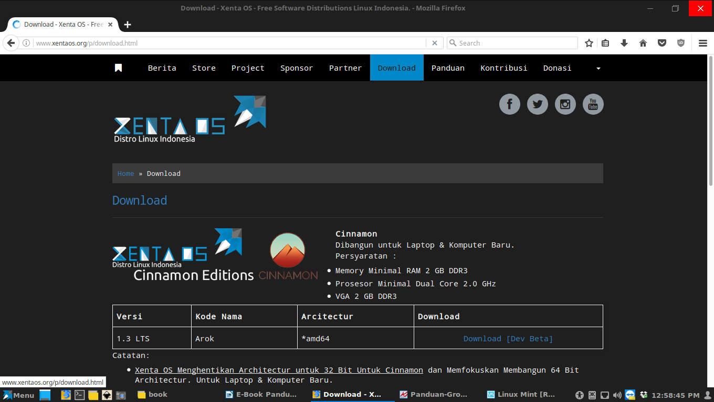

3.  Silahkan Download ISO Xenta OS di Halaman Download . Sudah tertata rapih. Terdapat Edisi Cinnamon dan XFCE. Beserta Informasinya.

Untuk Mengunduh ISO Xenta OS disarankan Menggunakan Aplikasi Download Manager. Pada Windows Terdapat aplikasi yang direkomendasikan **Free Download Manger** Tersedia Secara Gratis.

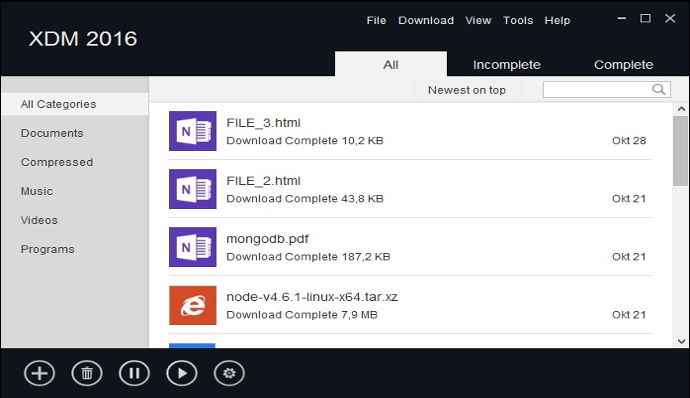Direkomendasikan Menggunakan XDM Jika Di Linux Silahkan Download Di Website Resminya :

[http://xdman.sourceforge.net/](http://xdman.sourceforge.net/)

Downloader Lain :

*   Uget Downloader Manager

### Media Bootable {#media-bootable}

#### Membuat Media Bootable Installasi {#membuat-media-bootable-installasi}

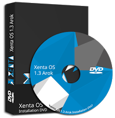

Media Installasi adalah adalah sebuat Perangkat Pemasangan atau Peralatan yang digunakan untuk install. Berupa DVD Installer atau USB Flashdisk Installer yang nantinya digunakan sebagai Media Untuk Memasang Xenta OS di Laptop, Notebook atau Komputer Desktop.

Mengenal File ISO

ISO adalah Sebuah file arsip (juga dikenal sebagai image disk) dari sebuah optical disc, terdiri dari isi data setiap sektor dari optical disc, termasuk sistem file disk optik.

ISO images dapat dibuat dari cakram optik, atau dapat digunakan untuk menciptakan kembali disc optik menggunakan perangkat lunak dari banyak vendor perangkat lunak.

Jenis ISO (Disk Image) :

*   ISO Biasa

Jika Sistem berkas ISO 9660 (iso) yang dibuat oleh perintah mkisofs akan di-boot melalui firmware BIOS, namun hanya dari media optik seperti CD, DVD, atau BluerayDisk.

Kelemahan :

_- ISO ini sudah pasti hanya bisa di booting melalui media DVD / CD /BluerayDisk yang telah diburning ._ - _Jenis ini terkadanag_ _Tidak Bisa dibuat bootable ke Media USB seperti MicroSD atau FlashDisk. Oleh sebab itu jika iso ini dibuat bootable maka tidak akan bisa membooting osnya._

*   **ISO** **Hybrid**Fitur isohybrid meningkatkan filesystem seperti itu oleh Master Boot Record (MBR) untuk booting melalui BIOS dari perangkat penyimpanan disk seperti USB flash drive.**Keunggulanya :**

- ISO ini sudah bisa di booting melalui media DVD / CD /BluerayDisk yang telah diburning . - Bisa dibuat bootable ke Media USB seperti MicroSD atau FlashDisk.

**_Xenta OS Menggunakan Jenis_ ****_ISO_ ****_Hybrid_**

##### Membuat Media Bootable Installasi DVD {#membuat-media-bootable-installasi-dvd}

###### Di Windows {#di-windows}

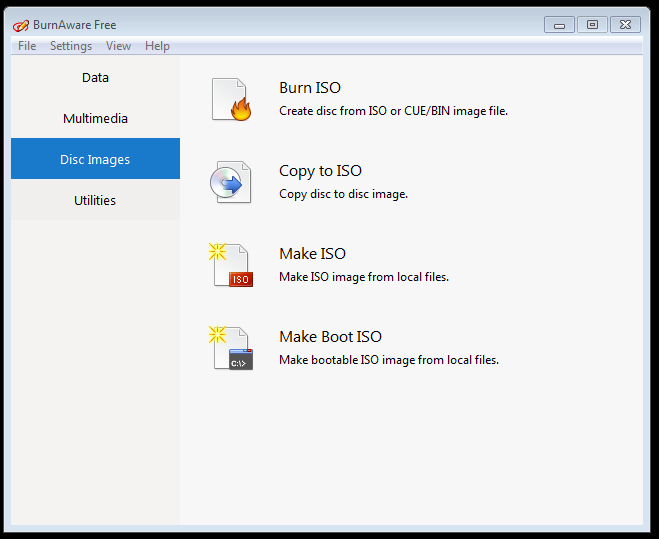

Membuat Media Installasi DVD Bootable Xenta OS di Windows tersedia menggunakan software burning ( pembakar ISO Ke DVD Blank).

Software Burning Windows yang Gratis direkomendasikan :

**Burnaware Free** adalah perangkat lunak yang tersedia secara gratis dan berbayar. Fiturnya cukup lengkap dengan tampilan yang user friendly (mudah).

[http://www.burnaware.com](http://www.burnaware.com/)

Direkomendasikan :

*   **Burnaware** **Free** [Download](http://www.burnaware.com/download.html)

Cara Membuat DVD Bootable Xenta OS dengan **Burnaware** **Free**:

1.  Memiliki Perangkat DVD RW Internal/Eksternal Untuk Menulis DVD R/RW Kosong.

2.  Memiliki DVD R/RW Kosong.

3.  Install Software Burnaware Freenya.

4.  Buka Sofware Burnawarenya Freenya.

5.  Masukan DVD R/RW Kosong keperangkat DVD RW Internal/Eksternal.

6.  Klik pada ikon **Burn ISO** di Jendela Utama. Tata letak proyek akan ditampilkan di jendela terpisah.

7.  Cari file ISO Xenta OS Yang sudah didownload, atau cukup seret file ISO Xenta OS dari Windows Explorer.

8.  Klik pada tombol **Burn**, Tunggu sampai proses perekaman selesai.

###### Di Linux {#di-linux}

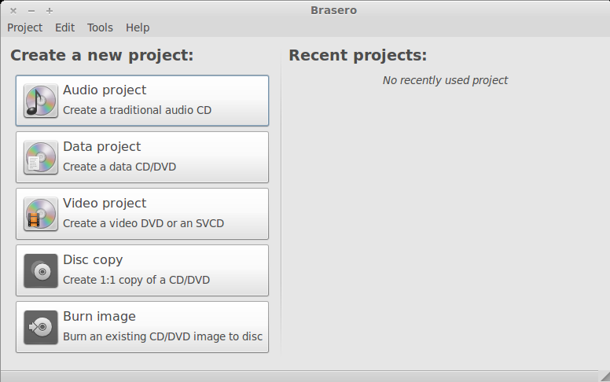Membuat Media Installasi DVD Bootable Xenta OS di Linux tersedia menggunakan software burning brasero.

**Brasero** adalah aplikasi untuk membakar CD / DVD. Distro Linux seperti ubuntu, linux mint sudah menyertakan secara bawaan.

Cara Membuat DVD Bootable Xenta OS dengan **Brasero**:

1.  Memiliki Perangkat DVD RW Internal/Eksternal Untuk Menulis DVD R/RW Kosong.

2.  Memiliki DVD R/RW Kosong.

3.  Install Software Braseronya. (Kebanyakan Linux Distro Sudah Menyertakan Brasero)

4.  Jika Belum silahkan Install braseronya

5.  Buka Sofware Brasero nya

6.  Masukan DVD R/RW Kosong keperangkat DVD RW Internal/Eksternal.

7.  Klik pada ikon **Burn** **Image**lalu akan tampil dibawah ini :

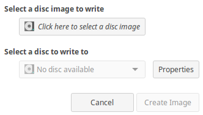

1.  Klik Tombol “**Click here to select a disk image**” dan Cari file ISO Xenta OS Yang sudah didownload.

2.  Klik Tombol “**Create Image**” Tunggu sampai proses perekaman selesai.

##### Membuat Media Bootable Installasi USB Flashdisk {#membuat-media-bootable-installasi-usb-flashdisk}

###### Di Windows {#di-windows-0}

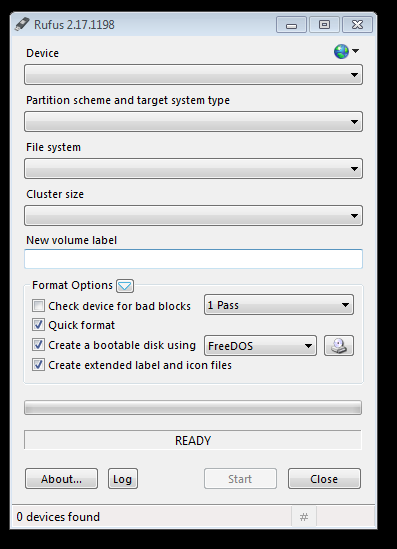Membuat Media Installasi USB Bootable Xenta OS di Windows tersedia dan direkomendasikan menggunakan software gratis “Rufus”.

Rufus adalah sebuah aplikasi yang digunakan untuk membuat USB _bootable_ dan memformat USB.

Silahkan Download di situs resminya :

[https://rufus.akeo.ie/](https://rufus.akeo.ie/)

Persyaratan:

*   Memiliki Flashdisk dengan Kapasitas Minimal 2GB

Cara Membuat USB Bootable Xenta OS dengan Rufus :

*   Colokan USB Flashdik ke Port USB di laptop / Komputer.

    Cabut Semua Flasdisk yang lain jika ada yang terhubung ke laptop / komputer untuk menghidari data hilang dikarenkan salah target usb flashdisknya.

*   Pastikan Sudah Mendownload dan Mengisntall Software Rufusnya.

*   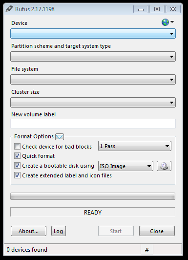Jalankan Software Rufusnya **cari dan Klik Icons** **ini**

    

*   Nanti akan Muncul Jendela Explorer kecil.

*   Lalu Cari dan klik 2x file ISO Xenta OS Yang sudah didownload.

*   Klik Tombol “**Start**”, akan muncul dialog pilih saja “**Yes**” dan Tunggu sampai proses penulisan iso ke usb flasdisk selesai.

###### Di Linux {#di-linux-0}

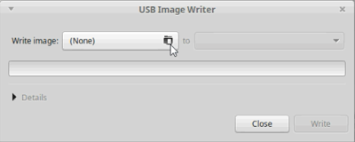

Membuat Media Installasi USB Bootable Xenta OS di **Linux**tersedia dan direkomendasikan menggunakan software gratis “USB Image Writer”.

Perangkat Lunak lain :

*   uNetbootin

*   YUMI

*   Either.io

_N__amanya mintst__i__ck jika di linux mint dan sudah tersedia secara bawaan atau di ubuntu namanya_ _usb_ _image writer._

Cara Membuat USB Bootable Xenta OS dengan mintstick atau usb image writer :

*   Colokan USB Flashdik ke Port USB di laptop / Komputer.

    Cabut Semua Flasdisk yang lain jika ada yang terhubung ke laptop / komputer untuk menghidari data hilang dikarenkan salah target usb flashdisknya.

*   Cari Aplikasi di menu “USB Image Writter”

    *   *   *   *   *   *   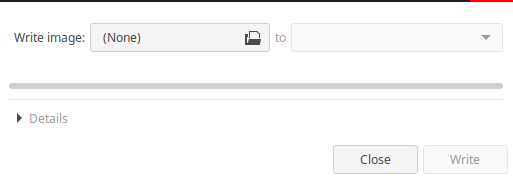Keterangan:

                            Write image: menunjukan file iso yang mau di tulis ke usb

                            to : untk lokasi USB Flasdisknya

*   Klik **“****(None)”** lalu Cari dan klik 2x file ISO Xenta OS Yang sudah didownload. Jika Sudah Klik Sebelahnya dan Tentukan ke Flasdisk Yang Dituju usb flasdisknya lihat contoh :

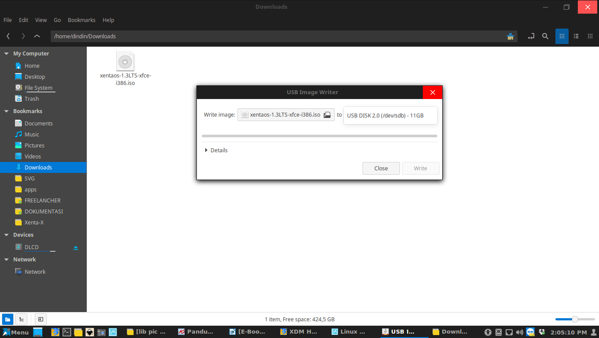

*   Lalu Klik **“Write”** Nanti akan Muncul Jendela Menayakan Password, Silahkan Masukkan password User Root dan klik “**Authenticate”**

*   Tunggu sampai proses penulisan iso ke usb flasdisk selesai.