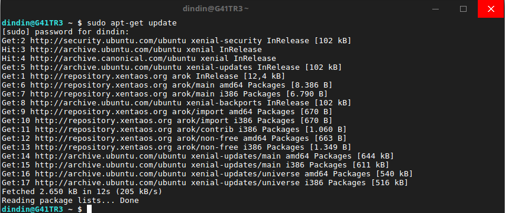
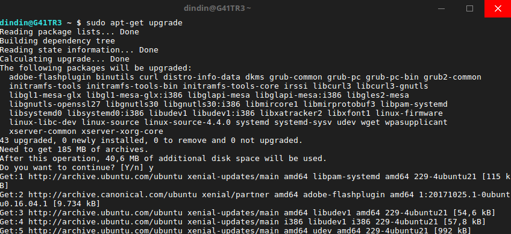

## Sesudah Installasi {#sesudah-installasi}

### BIOS {#bios}

#### Mengatur Booting Device {#mengatur-booting-device}

### Melakukan Pemutakhiran Paket {#melakukan-pemutakhiran-paket}

Setelah Berhasil Melakukan Install Xenta OS hal hal yang harus diperhatikan adalah paket paket dari sistem operasi harus diperbaharui. Saat ini Xenta OS menyediakan pembaharuan melalui perkakas command line yang disebut “APT”.

#### Memutahirkan sistem dan aplikasi (upgrade) {#memutahirkan-sistem-dan-aplikasi-upgrade}

Jika sebuah versi baru dari paket yang terpasang dalam komputer Anda telah tersedia Anda dapat memutakhirkannya. Ini mungkin berupa sebuah update keamanan untuk beberapa komponen dalam sistem operasi, mungkin pula berupa sebuah optimasi dalam salah satu pustaka tertentu atau bahkan mungkin versi lebih baru dari Firefox.

Pada dasarnya, sistem Anda terdiri atas paket-paket dan setiap bagiannya dapat dimutkahirkan dengan memutkahirkan beberapa paket tersebut. Ini berarti menggantikan paket terkini dengan versi yang lebih baru.

Untuk Melakukan Pemutakhiran sistem dan aplikasi jalankan perintah Berikut

1.  Buka Terminal (Sorcut CTRL + ALT + T)

2.  Pertama Melakukan Update Database aplikasi Ketikkan Baris Perintah Berikut

    sudo apt-get update

    Keterangan :

    Jika diminta untuk memasukan password silahkan masukan passwordnya lalu etkan “enter”
3.  Kedua Melakukan Upgrade Ketikan Baris Perintah Berikut

    sudo apt-get update

    Keterangan :

    Jika diminta untuk memasukan password silahkan masukan passwordnya lalu etkan “enter”
4.  Tunggu samapai selesai jika ada paket yang tersedia pembaharuan.