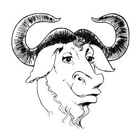

## GNU {#gnu}

### Sejarah Proyek GNU {#sejarah-proyek-gnu}

Gambar 1.2: Logo GNU

GNU akronim dari **GNU&#039;s not Unix**, merupakan sebuah proyek yang digagas oleh Richard Stallman untuk membuat sistem operasi Unix-like yang berbasis semangat free Software.

Namanya merupakan akronim berulang untuk GNU&#039;s Not UNIX (GNU bukanlah UNIX) nama itu dipilih karena rancangannya mirip Unix, tetapi berbeda dari UNIX, GNU tidak mengandung kode-kode UNIX. Pengembangan GNU dimulakan oleh Richard Stallman dan merupakan fokus asli Free Software Foundation (FSF).

Gambar 1.3 Richard Stallman

Pada tahun 1984 Richard Stallman meluncurkan sebuah proyek yang disebut dengan GNU (GNU&#039;S NOT UNIX) untuk mengembangkan sebuah sistem perangkat lunak bebas (free) yang mirip dengan UNIX. Proyek ini merupakan wujud dari ketidak setujuan Stallman terhadap proprietary software (dimana source code dari sebuah program tidak bisa diketahui oleh orang lain).

Proyek ini diawali dengan membangun dari awal sebuah kompiler C yang dikenal dengan nama GCC dan kemudian juga Stallman menulis sebuah editor text yang bernama GNU Emacs.

Perangkat lunak bebas yang dicita-citakan oleh GNU bukan berarti perangkat lunak tersebut gratis, ada empat jenis kebebasan yang diinginkan GNU yaitu:

1.  Kebebasan untuk menjalankan perangkat lunak tersebut untuk tujuan apa saja (kebebasan 0).

2.  Kebebasan untuk mempelajari bagaimana perangkat lunak itu bekerja serta dapat disesuaikan dengan kebutuhan penggunanya (kebebasan 1).

3.  Kebebasan untuk menyebarluaskan kembali hasil salinan perangkat lunak tersebut sehingga dapat membantu pengguna lainnya (kebebasan 2).

4.  Kebebasan untuk meningkatkan kinerja perangkat lunak tersebut, dan dapat menyebarkannya kembali sehingga dapat dinikmati oleh semua orang (kebebasan 3)

Sebuah perangkat lunak disebut dengan perangkat lunak bebas (freesoftware) jika ke-empat prinsip kebebasan tersebut terpenuhi oleh perangkat lunak tersebut. Untuk melindungi kebebasan yang diinginkan oleh GNU, maka perangkat lunak bebas ini dilindungi oleh sebuah lisensi yang disebut dengan GNU GPL (GNU General Public Licence).

Untuk mengetahui lebih banyak lagi mengenai GNU dapat di lihat halaman resminya di [http://www.gnu.org/](http://www.gnu.org/) .

### Sejarah Free Software Foundation (FSF) {#sejarah-free-software-foundation-fsf}

Gambar 1.4: Logo FSF

Free Software Foundation (FSF) merupakan sebuah organisasi yang didirikan untuk membiayai pengembangan dari perangkat lunak bebas. Organisasi ini didirikan oleh Richard Stallman di tahun 1985 untuk mendukung gerakan dari Free Software GNU.

Pada awalnya FSF digunakan untuk mempekerjakan developer maupun relawan untuk mengembangkan perangkat lunak bebas. Untuk saat ini relawan FSF terfokus pada masalah hukum dan struktur komunitas pengembang perangkat lunak bebas. FSF memperoleh sumbangan dana dari kalangan perusahaan atau organisasi donatur lainnya yang sifatnya umum dan terbuka bagi siapa saja untuk kelangsungan FSF itu sendiri.

Untuk mengetahui lebih banyak lagi mengenai FSF dapat di lihat halaman resminya di [http://www.fsf.org/](http://www.fsf.org/).