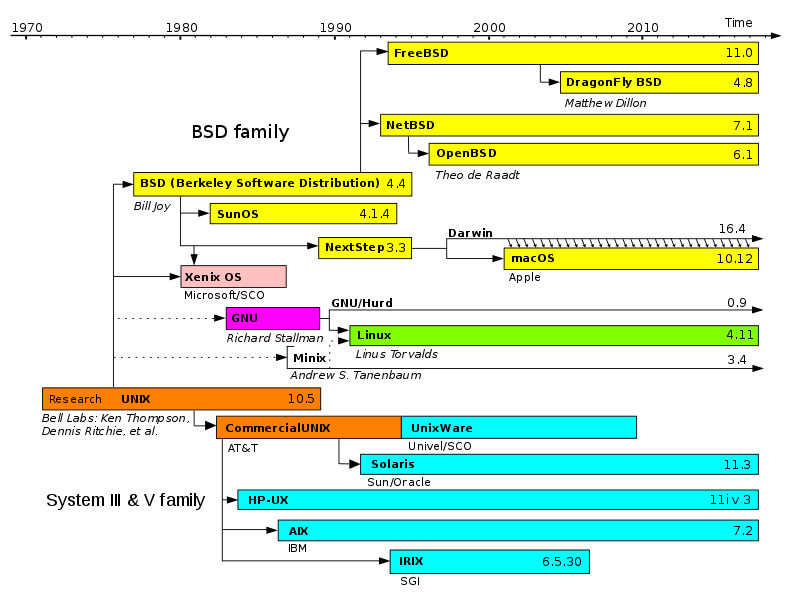
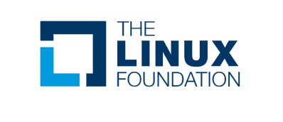

## Linux {#linux}

### Sejarah UNIX {#sejarah-unix}

Pada tahun 1969, Ken Thompson dan Dennis Ritchie (juga adalah developer bahasa C), para peneliti di AT&amp;T Bell Laboratorium Amerika, membuat sistem operasi **UNIX**. Selanjutnya UNIX Mendapatkan perhatian besar karena merupakan sistem operasi pertama yang dibuat bukan oleh hardware maker. Selain itu juga karena seluruh source code-nya dibuat dengan bahasa C, sehingga mempermudah pemindahannya ke berbagai platform.

Dalam waktu singkat UNIX berkembang dalam dua jalur : UNIX yang dikembangkan oleh Universitas Berkeley dan yang dikembangkan oleh AT&amp;T. Setelah itu mulai banyak perusahaan yang melibatkan diri, dan terjadilah persaingan yang melibatkan banyak perusahaan untuk memegang kontrol dalam bidang sistem operasi. Persaingan ini menyebabkan perlu adanya standarisasi. Dari sini lahirlah proyek POSIX yang dimotori oleh IEEE (The Institute of Electrical and Electronics Engineers) yang bertujuan untuk menetapkan spesifikasi standar UNIX. Sejak saat itu, muncul berbagai macam jenis UNIX.

Gambar 1.5: Sebuah ringkasan sejarah sistem operasi-sistem operasi [bertipe Unix](https://id.wikipedia.org/wiki/Sistem_operasi_bertipe_Unix)

### Sejarah Linux {#sejarah-linux}

**MINIX** adalah salah satu Jenis UNIX yang dikembangkan oleh Andy Tanenbaum pada tahun 1987 untuk tujuan pendidikan. Source code MINIX inilah yang menginspirasi lahirnya Linux.

Gambar 1.7: Maskot Kernel Linux

Gambar 1.6: Linus Torvalds

**Linux** merupakan sebuah Kernel dalam sistem operasi yang diciptakan oleh Linus Torvalds seorang Pelajar Universitas Helsinki Finlandia. Linux sendiri Merupakan proyek hobi yang bertujuan untuk membuat kernel yang gratis dan bebas.

Untuk menjadikan Linux sebuah sistem operasi yang utuh, Linus Torvalds memasukkan library, perangkat lunak(software) dari proyek GNU.

Inilah Menjadikan Kerancuan dalam penafsiran Linux sebagai kernel atau sistem operasi ?

Menurut Kutipan dari Proyek GNU yang dipimpin Richard Stallman.****

**_gnu.org:_**_Sebenarnya Linux memang ada, dan pengguna-pengguna yang disebut di atas memang menggunakannya, tapi itu sebenarnya hanya bagian dari sistem yang mereka gunakan. Linux adalah kernel: program di dalam sistem yang mengatur alokasi mesin dengan program-program lain yang dijalankan. Kernel adalah bagian penting dari sebuah sistem operasi, tetapi tidak akan berguna jika dijalankan sendirian. Kernel hanya akan berguna di dalam sebuah sistem operasi yang sempurna. Penggunaan Linux umumnya dikombinasikan dengan penggunaan sistem operasi GNU: keseluruhan sistem adalah GNU yang ditambahkan dengan Linux, disebut GNU/Linux. Semua distribusi yang dikenal sebagai “Linux” sebenarnya adalah distribusi GNU/Linux._

**_GNU/Linux_ **_adalah Sistem Operasi utuh yang merupakan gabungan aplikasi-aplikasi, libraries dan tools hasil developing dari GNU Project dengan kernel Linux._

**_GNU/Hurd_ **_dalah Sistem Operasi utuh yang merupakan gabungan aplikasi-aplikasi, libraries dan tools hasil developing dari GNU Project dengan kernel_ _Hurd yang dikembangkanya__._

### Sejarah Linux Foundation (LF) {#sejarah-linux-foundation-lf}

Linux Foundation (LF) adalah konsorsium teknologi nirlaba yang ditugaskan untuk mendorong pertumbuhan Linux. Didirikan pada tahun 2007 dengan penggabungan Open Source Development Labs (OSDL) dan Free Standards Group (FSG), Linux Foundation mensponsori karya-karya pencipta Linux Linus Torvalds dan didukung oleh perusahaan-perusahaan sumber terbuka dan terkemuka, termasuk perusahaan teknologi besar seperti Fujitsu, HP, IBM, Intel, NEC, Oracle, Qualcomm, dan Samsung, serta pengembang dari seluruh dunia..

Linux Foundation bertanggung jawab untuk mempromosikan melindungi, dan menstandarisasi Linux dengan &quot;menyediakan layanan yang komprehensif untuk bersaing secara efektif dengan platform tertutup&quot;.

Untuk mengetahui lebih banyak lagi mengenai LF dapat di lihat halaman resminya di

[https://www.linuxfoundation.org/](https://www.linuxfoundation.org/)