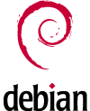

## Sejarah Keturunan **Distribusi** **GNU/Linux (Distro)** {#sejarah-keturunan-distribusi-gnu-linux-distro}

### **Distribusi** Debian GNU/Linux (Distro) {#distribusi-debian-gnu-linux-distro}

Debian adalah sistem operasi komputer yang tersusun dari paket-paket perangkat lunak yang dirilis sebagai perangkat lunak bebas dan terbuka dengan lisensi mayoritas GNU General Public License dan lisensi perangkat lunak bebas lainnya. Debian GNU/Linux memuat perkakas sistem operasi GNU dan kernel Linux merupakan distribusi Linux yang popmuler dan berpengaruh. Debian didistribusikan dengan akses ke repositori dengan ribuan paket perangkat lunak yang siap untuk instalasi dan digunakan.

Debian terkenal dengan sikap tegas pada filosofi dari Unix dan perangkat lunak bebas. Debian dapat digunakan pada beragam perangkat keras, mulai dari komputer jinjing dan desktop hingga telepon dan server. Debian fokus pada kestabilan dan keamanan. Debian banyak digunakan sebagai basis dari banyak distribusi GNU/Linux lainnya.

Gambar 1.8: Ian Murdock

Debian pertama kali diperkenalkan oleh Ian Murdock, seorang mahasiswa dari Universitas Purdue, Amerika Serikat, pada tanggal 16 Agustus 1993\. Nama Debian berasal dari kombinasi nama Ian dengan mantan-kekasihnya Debra Lynn: Deb dan Ian.

Pada awalnya, Ian memulainya dengan memodifikasi distribusi SLS (Softlanding Linux System). Namun, ia tidak puas dengan SLS yang telah dimodifikasi olehnya sehingga ia berpendapat bahwa lebih baik membangun sistem (distribusi Linux) dari nol (Dalam hal ini, Patrick Volkerding juga berusaha memodifikasi SLS. Ia berhasil dan distribusinya dikenal sebagai &quot;Slackware&quot;).

Proyek Debian tumbuh lambat pada awalnya dan merilis versi 0.9x pada tahun 1994 dan 1995\. Pengalihan arsitektur ke selain i386 dimulai pada tahun 1995\. Versi 1.x dimulai tahun 1996.

Pada tahun 1996, Bruce Perens menggantikan Ian Murdoch sebagai Pemimpin Proyek. Dalam tahun yang sama pengembang debian Ean Schuessler, berinisiatif untuk membentuk Debian Social Contract dan Debian Free Software Guidelines, memberikan standar dasar komitmen untuk pengembangan distribusi debian. Dia juga membentuk organisasi &quot;Software in Public Interest&quot; untuk menaungi debian secara legal dan hukum.

Di akhir tahun 2000, proyek debian melakukan perubahan dalam archive dan managemen rilis. Serta pada tahun yang sama para pengembang memulai konferensi dan workshop tahunan &quot;debconf&quot;.

Di April 8, 2007, Debian GNU/Linux 4.0 dirilis dengan nama kode &quot;Etch&quot;. Rilis versi terbaru Debian, 2009, diberi nama kode &quot;Lenny&quot;. deb adalah perpanjangan dari paket perangkat lunak Debian format dan nama yang paling sering digunakan untuk paket-paket binari seperti itu.

Paket debian adalah standar Unix pada arsip yang mencakup dua gzip, tar bzipped atau lzmaed arsip: salah satu yang memegang kendali informasi dan lain yang berisi data. Program kanonik untuk menangani paket-paket tersebut adalah dpkg, paling sering melalui apt/aptitude.

Beberapa paket Debian inti tersedia sebagai udebs (&quot;mikro deb&quot;), dan biasanya hanya digunakan untuk bootstrap instalasi Linux Debian. Meskipun file tersebut menggunakan ekstensi nama file udeb, mereka mematuhi spesifikasi struktur yang sama seperti biasa deb. Namun, tidak seperti rekan-rekan mereka deb, hanya berisi paket-paket udeb fungsional penting file. Secara khusus, file dokumentasi biasanya dihilangkan. udeb paket tidak dapat diinstal pada sistem Debian standar.

Paket debian juga digunakan dalam distribusi berbasis pada Debian, seperti Ubuntu dan lain-lain. Saat ini telah terdapat puluhan distribusi Linux yang berbasis kepada debian, salah satu yang paling menonjol dan menjadi fenomena adalah Ubuntu

### **Distribusi** Ubuntu (Distro) {#distribusi-ubuntu-distro}

Ubuntu merupakan salah satu distribusi Linux yang berbasiskan Debian dan didistribusikan sebagai perangkat lunak bebas. Nama Ubuntu berasal dari filosofi dari Afrika Selatan yang berarti &quot;kemanusiaan kepada sesama&quot;. Ubuntu dirancang untuk kepentingan penggunaan pribadi, namun versi server Ubuntu juga tersedia, dan telah dipakai secara luas.

Gambar 1.9: Mark Shuttleworth

Proyek Ubuntu resmi disponsori oleh Canonical Ltd. yang merupakan sebuah perusahaan yang dimiliki oleh pengusaha Afrika Selatan Mark Shuttleworth. Tujuan dari distribusi Linux Ubuntu adalah membawa semangat yang terkandung di dalam filosofi Ubuntu ke dalam dunia perangkat lunak. Ubuntu adalah sistem operasi lengkap berbasis Linux, tersedia secara bebas, dan mempunyai dukungan baik yang berasal dari komunitas maupun tenaga ahli profesional.

Ubuntu adalah salah satu proyek andalan Debian. Sasaran awal Ubuntu adalah menciptakan sistem operasi desktop Linux yang mudah dipakai. Ubuntu dijadwalkan dirilis setiap 6 bulan sehingga sistem Ubuntu dapat terus diperbarui.

Ubuntu pertama kali dirilis pada 20 Oktober 2004\. Semenjak itu, Canonical telah merilis versi Ubuntu yang baru setiap 6 bulan sekali. Setiap rilis didukung selama 18 bulan untuk pembaruan sistem, keamanan, dan kesalahan (bug). Setiap 2 tahun sekali (versi xx.04 dengan x angka genap) akan mendapatkan Long Term Support(LTS) selama 3 tahun untuk desktop dan 5 tahun untuk edisi server. Namun Ubuntu 12.04 yang dirilis pada April 2012 mendapatkan pembaruan sistem selama 5 tahun . Perpanjangan dukungan ini bertujuan untuk mengakomodasi bisnis dan pengguna IT yang bekerja pada siklus panjang dan pertimbangan biaya yang mahal untuk memperbarui sistem.

### Distribusi Linux Mint (Distro) {#distribusi-linux-mint-distro}

 Linux Mint adalah sistem operasi Linux yang merupakan suatu distribusi Linux dengan basis Debian dan Ubuntu, dengan Linux Mint Debian Edition (LMDE) sebagai suatu alternatif yang sepenuhnya berbasis Debian. Aplikasi yang dapat berjalan di Ubuntu, juga bisa berjalan pada LinuxMint. Walaupun inti dari Linux Mint adalah Ubuntu, Linux Mint hadir dengan tampilan yang berbeda dengan Ubuntu. Distribusi ini dibuat oleh Clement Lefebvre, dan dikembangkan secara aktif oleh tim dari Linux Mint maupun komunitas yang ada di dalamnya.

Gambar 1.10: Clement Lefebvre

Perusahaan dan pengguna perorangan yang menggunakan sistem operasi Linux Mint bertindak sebagai donatur, sponsor, dan mitra distribusi ini. Linux Mint bergantung pada umpan balik pengguna untuk membuat berbagai keputusan dan mengarahkan pengembangannya. Blog resminya seringkali memuat diskusi di mana para pengguna diminta untuk menyuarakan pendapat mereka tentang fitur-fitur terbaru atau keputusan yang diterapkan untuk rilis mendatang. Semua gagaasan dapat disampaikan, dikomentari dan dinilai oleh para pengguna melalui Situs Komunitas Linux Mint. Komunitas para pengguna Linux Mint menggunakan Launchpad untuk berpartisipasi dalam penerjemahan sistem operasi ini dan pelaporan bug.

Pengembangan yang paling asing dilakukan dengan Python dan diorganisir secara daring pada GitHub, sehingga mudah bagi para pengembang untuk menyediakan tambalan, menerapkan fitur-fitur tambahan atau bahkan melakukan pencabangan sub-proyek Linux Mint (sebagai contohnya menu Linux Mint diporta ke Fedora). Dalam setiap rilisnya, beragam fitur ditambahkan yang mana merupakan hasil pengembangan komunitas tersebut. Pada Linux Mint 9 misalnya, kemampuan untuk menyunting butir menu adalah suatu fitur yang merupakan kontribusi seorang pengguna Linux Mint.