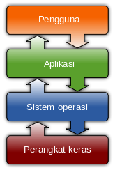

## Sistem Operasi {#sistem-operasi}

Gambar 1.1

Sistem operasi (bahasa Inggris: operating system) adalah perangkat lunak sistem yang mengatur sumber daya dari perangkat keras (hardware) dan perangkat lunak (software).

Secara umum, sistem operasi adalah perangkat lunak pada lapisan pertama yang ditempatkan pada memori komputer pada saat komputer dinyalakan booting. Sedangkan software-software lainnya dijalankan setelah sistem operasi berjalan, dan sistem operasi akan melakukan layanan inti untuk software-software itu. Layanan inti tersebut seperti akses ke disk, manajemen memori, penjadwalan tugas schedule task, dan antar-muka user GUI/CLI.

Sehingga masing-masing software tidak perlu lagi melakukan tugas-tugas inti umum tersebut, karena dapat dilayani dan dilakukan oleh sistem operasi. Bagian kode yang melakukan tugas-tugas inti dan umum tersebut dinamakan dengan &quot;kernel&quot; suatu sistem operasi.

Beberapa sistem operasi yang ada saat ini adalah:

*   Microsoft Windows

*   Mac OS

*   BSD

*   GNU/Linux