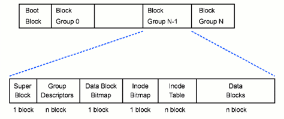

## File System di Linux {#file-system-di-linux}

Sistem file (file system) atau sistem berkas merupakan struktur logika yang digunakan untuk mengendalikan akses terhadap data yang ada pada disk. Dengan kata lain, sistem file merupakan database khusus untuk penyimpanan, pengelolaan, manipulasi dan pengambilan data, agar mudah ditemukan dan diakses.

stem) Linux: [http://dosen.gufron.com/artikel/mengenal-sistem-file-file-system-linux/18/](http://dosen.gufron.com/artikel/mengenal-sistem-file-file-system-linux/18/)

Hubungan antara sistem operasi dengan sistem file adalah sistem file (file system) merupakan interface yang menghubungkan sistem operasi dengan disk. Ketika program menginginkan pembacaan dari hard disk atau media penyimpanan lainnya, sistem operasi akan meminta sistem file untuk mencari lokasi dari file yang diinginkan. Setelah file ditemukan, sistem file (file system) akan membuka dan membaca file tersebut, kemudian mengirimkan informasinya kepada sistem operasi dan akhirnya bisa dibaca oleh pengguna.

Sistem operasi Linux mendukung banyak File System yang berbeda, tapi pilihan yang umum digunakan adalah keluarga Ext* (Ext2, Ext3 dan Ext4). Berikut sistem file yang umumnya digunakan pada sistem operasi Linux:

### Ext2 (2nd Extended) {#ext2-2nd-extended}

Ext2 merupakan jenis sistem file Linux paling tua yang masih ada. Sistem file ini pertama kali dikenalkan pada Januari 1993\. File system ini ditulis oleh Rémy Card, Theodore T. dan Stephen Tweedie. File system ini merupakan penulisan ulang besar-besaran dari Extended file system. Ext2 adalah sistem file yang paling ampuh di Linux dan menjadi dasar dari segala distribusi linux.

Pada sistem file Ext2, file data disimpan sebagai data blok. Data blok ini mempunyai panjang yang sama dan meskipun panjangnya bervariasi di antara sistem file Ext2, besar blok tersebut ditentukan pada saat sistem file dibuat dengan mk2fs. Jika besar blok adalah 1024 bytes, maka file dengan besar 1025 bytes akan memakai 2 blok. Ini berarti kita membuang setengah blok per file.

Sistem file Ext2 menyimpan data secara hirarki standar yang banyak digunakan oleh sistem operasi. Data tersimpan di dalam file, file tersimpan di dalam direktori. Sebuah direktori bisa mencakup file dan direktori lagi di dalamnya yang disebut sub direktori.

Ext2 mendefinisikan topologi sistem file dengan memberikan arti bahwa setiap file pada sistem diasosiasiakan dengan struktur data inode. Sebuah inode menunjukkan blok mana dalam suatu file tentang hak akses setiap file, waktu modifikasi file, dan tipe file. Setiap file dalam sistem file Ext2 terdiri dari inode tunggal dan setiap inode mempunyai nomor identifikasi yang unik. Inode-inode file sistem disimpan dalam tabel inode. Direktori dalam sistem file Ext2 adalah file khusus yang mengandung pointer ke inode masing-masing isi direktori tersebut.

Gufron Rajo KaciakStruktur Sistem File Ext2

a. Inode dalam Ext2

Inode adalah kerangka dasar yang membangun Ext2\. Inode dari setiap kumpulan blok disimpan dalam tabel inode bersama dengan peta bit yang menyebabkan sistem dapat mengetahui inode mana yang telah teralokasi dana inode mana yang belum. Inode juga dapat menunjuk pada device khusus dan dapat menangani program sehingga program dapat mengakses ke device. Semua file device di dalam drektori /dev dapat membantu program mengakses device.

b. Superblok dalam Ext2

Superblok mengandung informasi tentang ukuran dasar dan bentuk file sistem. Informasi di dalamnya memungkinkan file system manager untuk menggunakan dan merawat sistem file. Biasanya, hanya superblok di blok group 0 saat file sistem di-mount tetapi setiap blok grup mengandung duplikatnya untuk menjaga jika file sistem menjadi rusak. Informasi yang dikandung adalah:

*   Magic Number, meyakinkan software bahwa ini adalah superblok dari sistem file Ext2.

*   Revision Level, menunjukkan revisi mayor dan minor dari sistem file.

*   Mount Count dan Maximum Mount Count, menunjukkan pada sistem jika harus dilakukan pengecekan dan maksimum mount yang diijikan sebelum e2fsck dijalankan.

*   Blocks per Size, besar blok dalam file sistem, contohnya 1024 bytes.

*   Blocks per Group, banyaknya blok per grup.

*   Block Group Number, nomor blok grup yang mengadung copy dari superblok.

*   Free Blocks, banyaknya blok yang kosong dalam file sistem.

*   Free Inode, banyak inode kosong dalam file sistem.

*   First Inode, nomor inode dalam inode pertama dalam file sistem, inode pertama dalam Ext2 root file sistem adalah direktori &quot;/&quot;.

Ext2 pertama kali dikembangkan dan diintegrasikan pada kernel Linux, dan sekarang ini sedang dikembangkan juga penggunaannya pada sistem operasi lainnya.

Tujuannya adalah untuk membuat suatu file system yang powerful, yang dapat mengimplementasikan file-file semantik dari UNIX dan mempunyai pelayanan advance features.

Kemampuan:

*   File system Ext2 mampu menyokong beberapa tipe file yang standar dari UNIX, seperti regular file, directories, device special files, dan symbolic links.

*   Ext2 mampu mengatur file-file system yang dibuat dalam partisi yang besar.

*   File system Ext2 mampu menghasilkan nama-nama file yang panjang. Maximum 255 karakter.

*   Ext2 memerlukan beberapa blok untuk super user (root).

### Ext3 (3rd Extended) {#ext3-3rd-extended}

Ext3 adalah peningkatan dari sistem file Ext2\. Peningkatan ini memiliki beberapa keuntungan, diantaranya:

Ext3 merupakan suatu journalled file system, journalled file system didesain untuk membantu melindungi data yang ada di dalamnya. Dengan adanya journalled filesystem, maka kita tidak perlu lagi untuk melakukan pengecekan kekonsistensian data, yang akan memakan waktu sangat lama bagi harddisk yang berkapasitas besar.

Ext3 adalah suatu filesystem yang dikembangkan untuk digunakan pada sistem operasi Linux. Ext3 merupakan hasil perbaikan dari Ext2 ke dalam bentuk Ext2 yang lebih baik dengan menambahkan berbagai macam keunggulan.

Kelebihan:

*   Ext3 tidak mendukung proses pengecekan file system, bahkan ketika system yang belum dibersihkan mengalami “shutdown”, kecuali pada beberapa kesalahan hardware yang sangat jarang.

*   Hal seperti ini terjadi karena data ditulis atau disimpan ke dalam disk dalam suatu cara sehingga file system-nya selalu konsisten.

*   Waktu yang diperlukan untuk me-recover Ext3 file system setelah system yang belum dibersihkan dimatikan

*   Tidak tergantung dari ukuran file system atau jumlah file; tetapi tergantung kepada ukuran “jurnal” yang digunakan untuk memelihara konsistensi. Jurnal dengan ukuran awal (default)

*   Membutuhkan sekitar 1 sekon untuk recover (tergantung dari kecepatan hardware).

*   Journaling,dengan menggunakan journaling, maka waktu recovery pada shutdown mendadak tidak akan selama pada Ext2\. Namun ini menjadi kekurangan dari Ext3, karena dengan adanya fitur journaling, maka membutuhkan memori yang lebih dan memperlambat operasi I/O (Input/Output).

*   Integritas data,Ext3 menjamin adanya integritas data setelah terjadi kerusakan atau unclean shut down. Ext3 memungkinkan kita memilih jenis dan tipe proteksi dari data.

*   Kecepatan,daripada menulis data lebih dari sekali, Ext3 mempunyai throughput yang lebih besar daripada Ext2 karena Ext3 memaksimalkan pergerakan head hard disk. Kita bisa memilih tiga jurnal mode untuk memaksimalkan kecepatan, tetapi integritas data tidak terjamin.

*   Mudah dilakukan migrasi,kita dapat berpindah dari sistem file Ext2 ke sistem file Ext3 tanpa melakukan format ulang.

### Ext4 (4th Extended) {#ext4-4th-extended}

Ext4 merupakan peningkatan dari sistem file Ext3\. Ext4 dirilis secara lengkap dan stabil mulai dari kernel 2.6.28\. Keuntungan menggunakan Ext4 adalah mempunyai pengalamatan 48-bit blok yang artinya dia akan mempunyai 1 EiB = 1.048.576 TB. Ukuran maksimum sistem file 16 TB.

Ext4 dirilis secara komplit dan stabil berawal dari kernel 2.6.28 jadi apabila distro anda yang secara default memiliki versi kernel tersebuat atau di atas nya otomatis system anda sudah support Ext4 (dengan catatan sudah di include kedalam kernelnya) selain itu versi e2fsprogs harus mengunakan versi 1.41.5 atau lebih.

Kelebihan:

*   Telah dinyatakan stabil dan didukung sejak kernel linux 2.6.28\.

*   Didesign untuk memberikan performance yang lebih baik dan peningkatan kemampuan.

*   Dapat meningkatkan daya tampung maksimal filesystem ke 1 Exa Byte (1,048,576 Tera Byte), dengan ukuran maksimum filesystem dengan 16 TB untuk maksimum file size nya, Fast fsck, Journal checksumming, Defragmentation support.

*   Mengurangi waktu yang diperlukan untuk melakukan pengecekan hardisk (fsck yang mana pada Filesystem Ext3, setiap 20­30 kali mount).

*   Berdasarkan test benchmark yang dilakukan oleh beberapa benchmarker, Filesystem Ext4 memiliki keunggulan performance yang significant dalam menulis dan membaca file berukuran besar.

*   Filesystem Ext4 menyisihkan filesystem lain seperti xfs, jfs, Reiserfs dan Ext3\. Dalam kasus Ubuntu 9.04, filesystem Ext4 di curigai sebagai faktor utama yang mempercepat waktu boot Ubuntu 9.04\. Filesystem Ext4 juga meningkatkan umur hidup media flash seperti SSD. Karena filesystem Ext4 tidak melakukan penulisan data layaknya Filesystem Ext3 yang menulis beberapa kali.

### Brtfs {#brtfs}

Btrfs adalah file sistem Linux yang masih dalam pengembangan. Hal ini tidak menjadi default pada kebanyakan distribusi Linux pada saat ini, tapi mungkin akan menggantikan Ext4 satu hari nanti. Tujuannya adalah untuk menyediakan fitur tambahan yang memungkinkan Linux untuk skala jumlah penyimpanan yang lebih besar.

B-Tree File System (BTRFS), kadang singkatan ini juga diucapkan BuTteR FS atau BeTteR FS merupakan sebuah file system di bawah lisensi General Public License (GPL). Chris Mason, Direktur Linux Kernel Engineering di Oracle, merupakan “bapak” dari BTRFS yang pertama kali memulai pembuatan file system yang salah satu fiturnya adalah memaintain checksum dari seluruh file data dan metadata ini.File system sendiri adalah sebuah mekanisme penyimpanan dan pengaturan file atau data pada sebuah komputer. Ada banyak jenis file system yang telah kita gunakan, seperti NTFS yang digunakan di Windows, ext2, ext3, ext4, dan lain-lain. Mengapa pemilihan file system menjadi penting? Dewasa ini, ukuran hard drive semakin besar. Namun demikian, kenaikan kecepatan akses ke memori tidak setara dengan kenaikan ukuran hard drive. Karenanya, dibutuhkan file system yang dapat mengatur mekanisme penyimpanan maupun pencarian data dari hard drive agar storage semakin reliable, dapat diakses dalam waktu yang cepat, serta efisien.B-Tree File System ini membuat Linux dapat lebih “mengatur” storage atau tempat penyimpanan yang ada. “Mengatur” dalam hal ini bukan berarti hanya mengatur dalam hal pengalamatan saja, namun juga dapat melakukan administrasi dan pengelolaan tempat penyimpanan tersebut dengan interface yang lebih bersih sehingga pengguna dapat melihat apa yang sedang dipakai dan dikerjakan dan juga membuatnya menjadi lebih “terpercaya”.Btrfs adalah Copy-On-Write file system yang ditujukan untuk mengimplementasikan fitur yang canggih dan juga terfokus pada fault tolerance, perbaikan, dan kemudahan administrasi. Fitur-fitur utama yang ada pada btrfs sekarang ini yaitu:

*   **_Extent based file storage (2^64 max file size, sekitar 18 juta TB)_**: sistem penyimpanan filenya berbasis extent sehingga meminimalisir fragmentasi dan penyebaran bagian file.

*   **_Space efficient packing of small files:_** Tidak menghabiskan waktu untuk sub-block file

*   _Space efficient indexed directories:_ Indexing pada directory yang hemat space sehingga membuat akses menjadi cepat dan ukuran directory yang relatif kecil.

*   **_Dynamic inode allocation:_** Alokasi yang dinamis terhadap inode(struktur data yang menyimpan informasi dasar dari suatu objek file system) sehingga tidak ada batasan tertentu terhadap jumlah inode.

*   **_Writable snapshots (Efficient incremental backup and FS mirroring):_** snapshot untuk backup dan duplikasi

*   **_Subvolumes (separate internal filesystem roots):_** FSCK small chunk bisa secara paralel. Ini yang merupakan salah satu alasan kenapa Btrfs menjadi salah satu FS yang cocok untuk backup (karena ada fitur snapshot juga subvolume, kedua fitur tersebut hampir identik)

*   **_Object level mirroring and striping :_ **konsep RAID yang diterapkan pada FS

*   **_Checksums on data and metadata (multiple algorithms available):_ **Checksum adalah suatu fungsi hash yang mengecek apakah data yang dikirim atau disimpan corrupt apa tidak.

*   **_Compression :_** efisiensi dari segi tempat dan kinerja. Memanfaatkan library zlib dari kernel Linux

*   **_Integrated multiple device support, with several RAID algorithms._ **RAID : Redundant Array of Independent Disks merupakan media penyimpanan pada beberapa disk.

*   **_Online filesystem check and defragmentation :_** Performance is slowed, but data is still accessible

*   **_Very fast offline filesystem check._**

*   **_Efficient incremental backup and FS mirroring :_** salah satunya dikarenakan fitur snapshot dan juga konsep RAID yang diimplementasikan

*   **_In-place conversion (with rollback) from ext3/4 to Btrfs:_** Btrfs dapat dikonversikan kembali ke file system ext3/4

*   **_User-defined transactions._**

### swap {#swap}

Swap adalah sebuah ruang pada harddisk yang dijadikan ruang virtual memory yang digunakan ketika komputer/laptop membutuhkan lebih banyak memory. Dalam artian partisi dengan filesystem Swap ini bekerja sebagai cadangan , apabila RAM yang digunakan penuh. Jadi sederhaana nya , Swap ini akan memberi pertolongan jika RAM yang kita kehabisan ruang kosong.