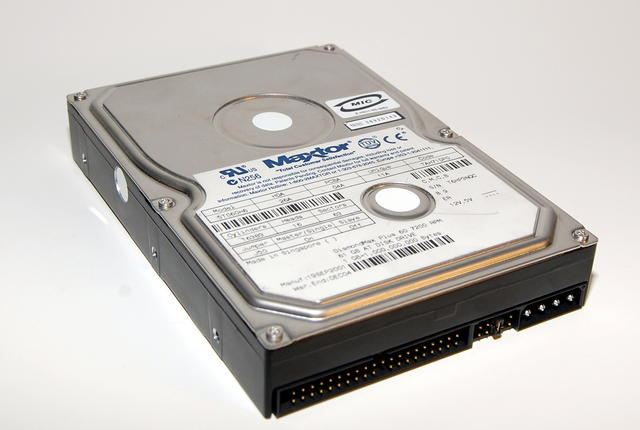

## Pengenalan Hardisk {#pengenalan-hardisk}

Hardisk ATA/IDE

ATA (Advanced Technology Attachment) standar adalah interface standar yang memungkinkan anda untuk menghubungkan perangkat penyimpanan kekomputer PC. Standar ATA dikembangkan pada tanggal 12 Mei 1994 oleh ANSI (dokumen X3.221-1994).Meskipunnamaresmi “ATA”, standar ini lebih dikenal dengan istilah komersial IDE (Integrated Drive Electronics) atau Enhanced IDE (EIDE atau E-IDE).

Standar ATA awalnya ditujukan untuk menghubungkan hard drive ,namun ekstensi yang disebut ATAPI (ATA Packet Interface) telah dikembangkan untuk dapat antarmuka perangkat penyimpanan lain ( CD-ROM drive , DVD-ROM drive , dll) pada ATA interface.

Hardisk SATA

Serial Advanced Technology Attachment (SATA) adalah bus primer pada komputer yang didesain untuk mentransfer data antara motherboard dan media penyimpanan data, seperti hard disk dan optical drive di dalam komputer. Keuntungan utama menggunakan hard disk SATA adalah transfer data yang lebih cepat, bisa memindahkan ataupun menambah device selama operasi (jika sistem operasinya support), kabel yang lebih tipis sehingga proses pendinginan udara dapat efisien, dan banyak keunggulan lainnya.