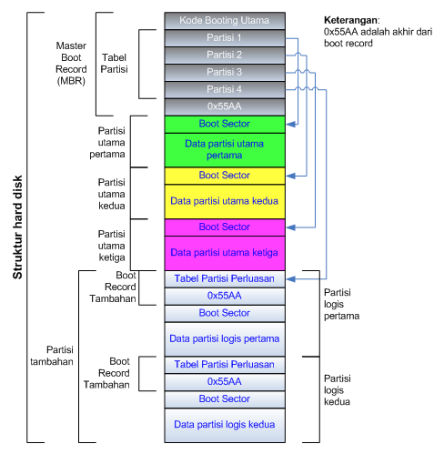
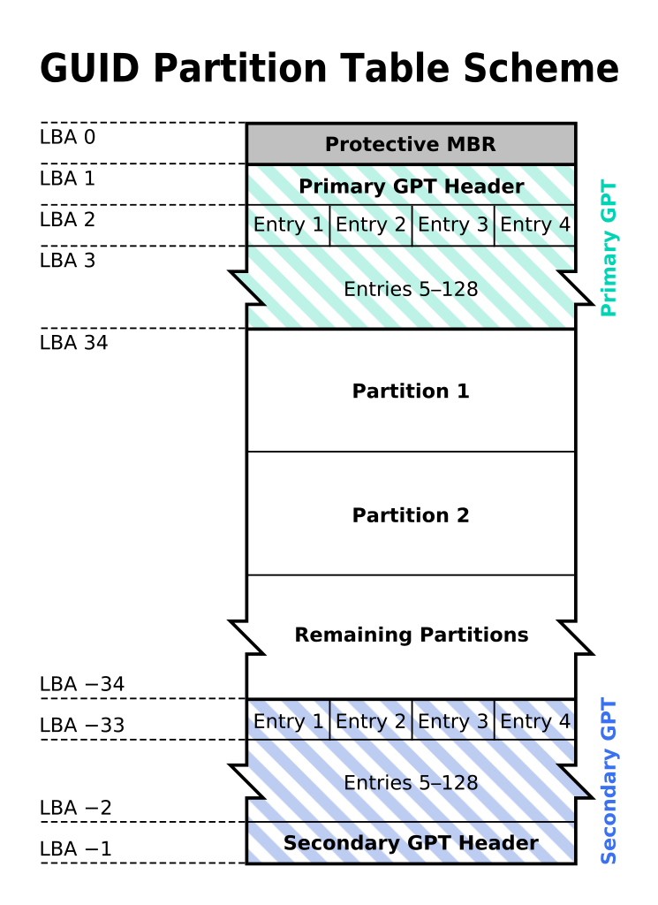
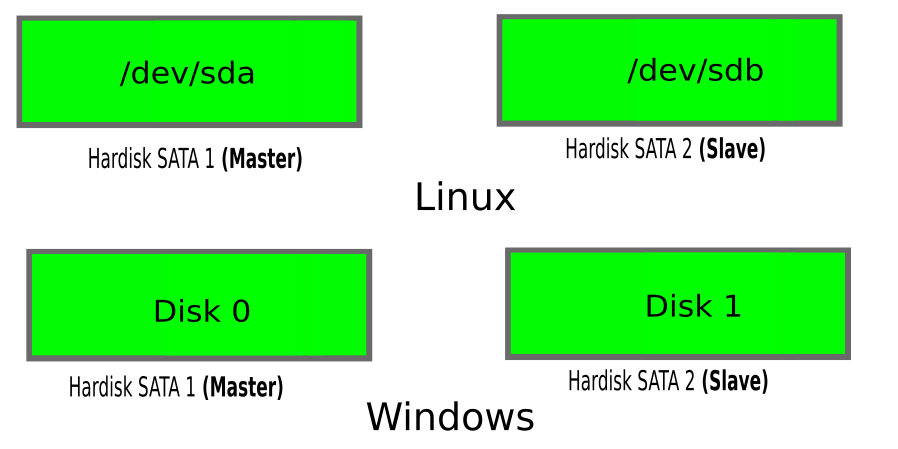
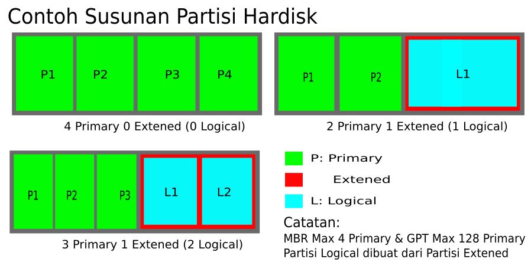
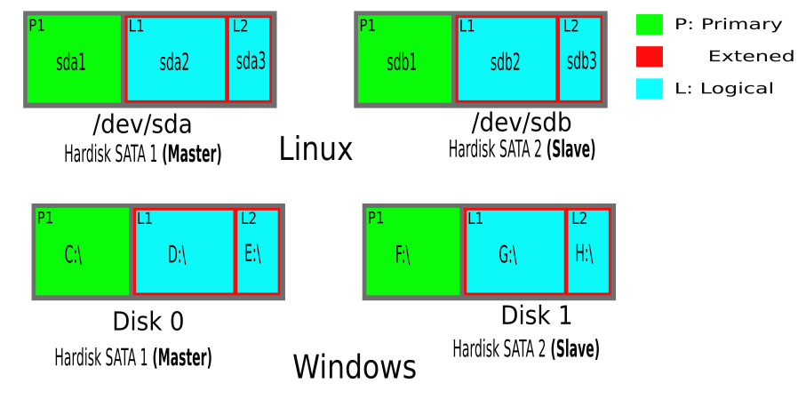

## Pengenalan Pemartisian {#pengenalan-pemartisian}

Partisi dapat dikatakan sebagai bagian atau daerah dari suatu memori atau media penyimpanan lain (hardisk dsb) yang terpisah-pisah secara logis dan berfungsi seolah-olah bagian itu terpisah secara fisik.

Dengan partisi hardisk kita bisa menginstal lebih dari dua sistem operasi dalam sebuah komputer. Partisi dilakukan untuk dapat memudahkan saat melakukan perbaikan. Misalkan ada salah satu partisi yang rusak, maka kita hanya perlu memperbaiki partisi tersebut, karena partisi yang lain tidak terpengaruhi. Partisi juga dapat mempercepat akses ke hardisk.

### Tabel Partisi Hardisk {#tabel-partisi-hardisk}

Bisa dikatan partition table ini adalah struktur yang menyimpan informasi dari partisi-partisi tadi. Ada 2 tipe partition table yang umum digunakan yaitu MBR **(Master Boot Record)**dan GPT (**_GUID Partition Table_****_)_** .

#### Tabel Partisi MBR {#tabel-partisi-mbr}

Keterangan : Struktur Hardisk dengan Tabel Partisi MBR (Master Boot Record)

Tabel Partisi MBR (Master Boot Record). Dalam Tabel Partisi MBR, semua informasi yang terdapat dalam disk dicatat oleh MBR. Tabel Partisi MBR ini memiliki peranan penting dalam sebuah proses booting sistem operasi. Tugas utama yaitu memberikan informasi dan mencari lokasi boot sector sistem operasi dalam partisi hardisk. Yang mana boot sector bersisi file-file dan informasi yang dibutuhkan oleh sistem operasi sehingga dapat mencapai startup dan sampi ke destop.

Pada saat Proses booting Tabel Partisi MBR (Master Boot Record) memiliki tugas-tugas berikut ini

*   Mencari partisi yang aktif (yang dapat melakukan proses booting) dalam tabel partisi.

*   Mencari sektor pertama dari partisi yang aktif untuk mendapatkan boot sector dari partisi tersebut.

*   Memuat salinan boot sector dari partisi yang aktif ke dalam memori.

*   Memberikan kontrol selanjutnya kepada kode yang dapat dieksekusi di dalam boot sector.

#### Tabel Partisi GPT {#tabel-partisi-gpt}

Keterangan : Struktur Tabel Partiti GPT (GUID Partition Table)

Tabel Partiti GPT (**GUID Partition Table**) merupakan standart terbaru dalam teknologi Tabel partisi hardisk. Menggunakan teknologi GUID (Global Enique Indentifiers) untuk menerjemahkan sebuah partisi. Pada partisi di GPT mampu menyimpan hingga 2^64 block (128 partisi) dan mendukung penyimpanan hingga 9,44 ZB (Zettabytes) tiap partisinya.

#### Perbedaan Tabel Partisi MBR &amp; GPT {#perbedaan-tabel-partisi-mbr-gpt}

GPT

*   GPT adalah standar yang relatif baru yang telah diperkenalkan oleh Intel untuk memastikan bahwa UEFI diganti dengan sesuatu inovatif dan lebih maju.

*   Tidak ada batas partisi di bawah sistem ini dan untuk alasan yang sama untuk dicatat bahwa nomor hanya terbatas berpose dalam hal ini adalah OS.

*   Dibandingkan dengan MBR ukuran disk yang sangat besar dan dapat menahan beban data yang dianggap tak terbayangkan.

*   Dengan GPT windows memungkinkan hingga 120 partisi dan tidak perlu diperpanjang partisi juga.

*   Ide MBR pelindung ini juga dimasukkan dalam partisi yang menyatakan bahwa ada satu partisi yang membentang di atas seluruh hard drive.

MBR

*   Pada MBR boot disk OS data disimpan dalam satu tempat dan jika data ini adalah ditimpa atau rusak maka pengguna adalah dalam kesulitan.

*   MBR juga dikenal sebagai &quot;Master Boot Record&quot; adalah standar industri yang akan memastikan bahwa sektor boot tidak seperti GPT terletak di awal drive.

*   Boot loader partisi MBT umumnya adalah kode kecil yang akan memastikan bahwa file boot yang relatif lebih besar nilai disimpan dari bagian atau partisi drive lain.

*   MBR bekerja baik-baik saja dengan hard drive yang 2TB dalam ukuran dan tidak mendukung drive yang lebih besar dari nilai yang disebutkan.

*   Partisi utama adalah untuk diganti dengan partisi extended tidak seperti GPT jika ukuran disk melebihi 2TB saat menggunakan MBR.

### Penaaman Hardisk di Linux {#penaaman-hardisk-di-linux}

Penamaan Hardisk yang terpasang, jika di Windows kita mengenal hardisk diberi nama dengan disk 0 adalah hardisk sata pertama (master) dan disk 1 adalah hardisk sata kedua (slave).

Pada Linux kita akan menemui sda adalah hardisk sata pertama (master) dan sdb adalah hardisk sata kedua (slave). Penjelasannya Lihat Gambar dibawah ini :

Gambar 3.1: Penamaan Hardisk Pada Linux dan Windows

### Tabel Penaman Hardisk di Linux {#tabel-penaman-hardisk-di-linux}

Berikut Tabel Penaam hardisk pada linux, di linux jenis hardisk diberi nama dan dibedakan dari jenis hardisknya itu sendiri :

| Jenis Hardisk | Penamaan Hardisk Di Linux |
| --- | --- |
| ATA/IDE | /dev/hda (primary master) |
| SATA | /dev/sda (primary master) |

### Susunan Partisi Hardisk {#susunan-partisi-hardisk}

Untuk mempartisi hardisk, kita memang bebas menentukan berapapun jumlah partisi yang akan kita buat namun ada aturan yang harus di pahami. Partisi di bagi menjadi tiga jenis yaitu Primary, Extended dan Logical

Gambar 3.2: Contoh Susunan Partisi dalam satu buah Hardisk

Keterangan :

1.  **Primary** : Partisi jenis ini maksimal ada 4 buah dalam satu hardisk jika menggunakan tabel partisi jenis MBR. Dalam prakteknya, kita cukup membutuhkan satu partisi Primary. Namun jika kita ingin menginstal banyak sistem operasi dalam satu hardisk, dibutuhkan lebih dari satu partisi Primary. Hal tersebut berlaku untuk OS yang hanya bisa booting dari partisi Primary, seperti DOS, WIn 3.x dan Win 9x. Sedangkan untuk OS lain seperti Win NT, Win Xp, Win Vista, WIn 7, LINUX, OS2, bisa booting dari jenis partisi Logical.

2.  **Extended** : Untuk jenis partisi ini hanya terdapat satu dalam satu hardisk, digunakan untuk menampung partisi Logical. Seperti diketahui dalam satu hardisk dibatasi hanya ada 4 Primary untuk jenis Partisi tabel MBR dan GPT Maximal ada 128 Primary , untuk menciptakan partis lebih banyak, partisi Extended dapat dimanfaatkan. Partisi ini tidak dapat menampung data, hanya digunakan untuk menampung partisi Logical. Dengan kata lain, partisi Extended adalah partisi Primary yang digunakan untuk menampung partisi Logical.

3.  **Logical** : Partisi jenis ini tidak dapat berdiri sendiri. Dia dan teman-temannya harus berada dalam partisi Extended. Jadi jika akan dibuat lebih dari 4 partisi, harus dibuat satu partisi Extended dan partisi Logical sejumlah yang dibutuhkan.

### Penamaan Partisi di Linux {#penamaan-partisi-di-linux}

Pada Windows kita Mengenalnya Local Disk [C:\](../../../../../../../C:/) , [D:\](../../../../../../../D:/) dan seterusnya. Berbeda halnya dilinux dilinux Hardisk Sata Pertama sebagai master diberinama sda1 dan untuk nama hardisknya /dev/sda berbeda untuk hardisk kedua sebagai slave yaitu diberinama sdb1 untuk partisi primary pertama dalam hardisk tersebut. Dan hardisknya dibernama /dev/sdb. Lebih Lengkapnya cek gambar di bawah ini :

Gambar 3.3: Penamaan Partisi dalam Sebuah Hardisk di Linux dan WIndows