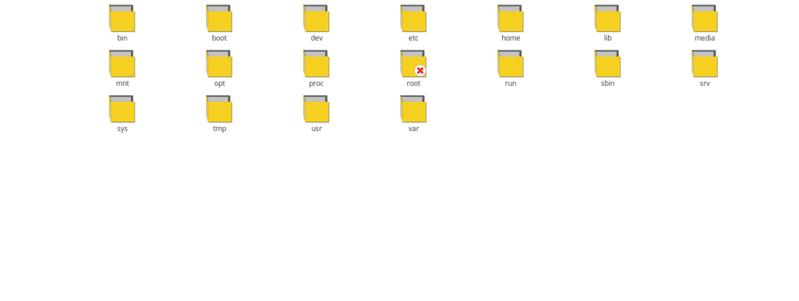

## Struktur Directory {#struktur-directory}

Di dalam Linux, menggunakan filesystem dimana directory akan tersusun ke dalam hirarkis tunggal. Berbeda dengan struktur di windows dimana susunan directory ditentukan dengan kondisi partisi dan harddisk.

Bentuk drive di windows merupakan representasi dari partisi dimana huruf C diberikan untuk partisi pertama di harddisk pertama. Di Linux tidak mengenal konsep drive. Berbagai macam partisi dapat di mount kedalam direktori yang berada di dalah struktur direktori linux.

Di Windows, untuk menunjukkan lokasi sebuah file, kita menuliskan seperti ini;

D:\Folder\tempat\menyimpan\file.txt

DI lingkungan Linux, untuk menunjukkan sebuah lokasi file, berupa seperti berikut;

$ /Folder/tempat/menyimpan/file.txt

Dari kedua perbedaan diatas, kita dapat mudah melihat perbedaan penggunaan slash di Linux versus backslashes di Windows. Dan juga tidak adanya nama drive (C:, D:, E: dll).

Perlu juga diingat bahwa penamaan file dan direktori di Linux adalah case-sensitive, yaitu huruf besar dan huruf kecil merupakan karakter yang berbeda.

/Folder/tempat/file.txt

beda dengan

/folder/Tempat/file.TXT

Struktur direktori Linux mengikuti standart “Filesystem Hierarchy Structure (FHS)” yang di pegang oleh Free Software Foundation, walaupun kebanyakan distribusi GNU/Linux (distro) memodifikasi standart tersebut.

Dibawah ini Stuktur File Sistem Directory dari Xenta OS, Uraian keguanaan atau fungsi foldernya dijelaskan :

### / (root) {#root}

Struktur direktori di Linux secara umum diawali dengan root filesystem “/” dan tentu juga merupakan root atau akar dari seluruh direktori global. Partisi dimana di letakkan / (root system) akan menjadi direktori sistem atau partisi pokok.

### /bin {#bin}

Berisi file-file binari atau aplikasi yang lebih umum dan dapat digunakan oleh semua user. Untuk memudahkan mengingat, direktori ini dianggap kependekan dari &#039;binary&#039;.

### /boot {#boot}

Direktori boot tesimpan file-file boot loader diantaranya grub atau lilo. Kernel, initrd dan system.map juga terletak didalam /boot. Jika system yang digunakan menggunakan partisi LVM ataupun partisi dalam jaringan. Maka ada baiknya dibuatkan partisi kecil tersendiri untuk meletakkan /boot di harddisk dengan filesystem konvensional. /boot ini umumnya sangat jarang sekali berubah isinya, kecuali memang kita sering bermain-main dengan kernel.

### /dev {#dev}

Merupakan pseudo filesystem, atau directory yang isinya sebenarnya bukan benar-benar berisi file. Isi dari /dev ini berkaitan dengan perangkat-perangkat yang terdapat pada system. Misalkan untuk informasi port serial, port printer, dapat di berlakukan seperti membaca file. Misalkan perangkat serial terletak di /dev/tty01, kemudian partisi dalam harddisk di sebut sebagai /dev/sda7\. dan lain sebagainya. Untuk memudahkan mengingat, direktori ini dianggap kependekan dari &#039;device&#039;.

### /etc {#etc}

Direktori /etc berisi file-file konfigurasi sistem. Mayoritas aplikasi dan layanan konfigurasinya tersimpan di direktori /etc termasuk diantaranya /etc/hosts, /etc/resolv.conf dan lain sebagainya. Di direktori /etc/init.d tersimpan konfigurasi bagaimana sebuah layanan dijalankan. Di direktori /etc/rc*.d tersimpan konfigurasi untuk menentukan service yang dijalankan untuk tiap-tiap sesi init.

### /home {#home}

Semua direktori home dari pengguna tersimpan di direktori ini dengan nama user masing-masing sebagai pengelompokannya. Untuk beberapa sistem linux yang di spesifikasikan untuk server, direktori pengguna masih dikelompokkan lagi kedalam /home/users.

Di dalama direktori /home/nama-user tersimpan konfigurasi-konfigurasi yang spesifik terhadap user tersebut. Oleh karena itu, berbeda user, walaupun berada di sistem yang sama bisa mendapat lingkungan dan tampilan yang sama sekali berbeda.

Direktori /home merupakan direktori yang paling &#039;dekat&#039; dengan user. Direktori /home ini bisa berisi dari dokumen-dokumen pekerjaan user hingga file-file hiburan seperti mp3 dan film juga termasuk foto-foto yang dimiliki oleh user.

Oleh karena itu, untuk membatasi agar file-file di pengguna tidak mendesak file-file system, sangat umum untuk meletakkan direktori /home di partisi yang terpisah. Hal ini dapat menahan file-file yang disimpan user hingga total ukuran tertentu tanpa mengganggu ruang gerak system.

### /lib {#lib}

Berisi file-file library atau pustaka dari semua aplikasi binari yang tersimpan dalam direktori /sbin dan /bin. Di direktori ini juga tersimpan berbagai macam librari yang digunakan untuk aplikasi lain. Konsep penggunaan librari bersama ini membuat aplikasi di linux dapat menghemat ukuran. Untuk memudahkan mengingat, direktori ini dianggap kependekan dari &#039;library&#039;

### /media {#media}

Merupakan direktori untuk menyimpan direktori-direktori mount point. CD-ROM, DVD, flash disk, bahkan floppy disk juga akan termount di direktori ini.

Pada distro-distro modern, sudah memberikan fasilitas untuk menampilkan device-device yang dimount ke depan Desktop. Sehingga pengguna tidak perlu susah-dan-repot menuju ke /media untuk dapat mengakses flash disk-nya tapi cukup lihat ke desktop-nya dan masuk ke direktori yang teerbuat baru di sana.

Untuk workstation yang terintegrasi dengan jaringan, pada umumnya untuk melakukan mounting storage network juga diletakkan di /media. Dengan dikelompokkan seperti itu maka mudah untuk mengenali bahwa semua yang berada di dalam /media merupakan media penyimpan.

### /mnt {#mnt}

Pada Linux yang masih umum menggunakan kernel 2.4.x. Untuk tempat mengumpulkan mount point berada di /mnt. Dikarenakan pada sistem berbasis kernel 2.6.x sudah menggunakan /media, maka /mnt ini umumnya kosong. /mnt bisa juga dijadikan mount point pada saat system rescue atau troubleshooting.

Untuk memudahkan mengingat, direktori ini dianggap kependekan dari &#039;mount&#039;.

### /opt {#opt}

Direktori /opt saat ini jarang digunakan. Beberapa paket software terpisah menggunakan direktori ini untuk menyimpan paket yang tidak menuju ke lokasi manapun. Untuk memudahkan mengingat, direktori ini dianggap kependekan dari &#039;optional&#039;

### /proc {#proc}

Direktori /proc juga merupakan pseudo filesystem yang mirip dengan /dev. Bedanya, /proc ini murni hanya berkaitan dengan sistem dan tidak menyangkut pada device. Jika kita melakukan pengecekan ukuran penggunaan space, jangan terkecoh dengan direktori /proc yang tercatat menunjukkan memakan space sangat besar.

Segala macam space yang tertulis disitu sama sekali tidak terdapat di dalam media penyimpanan harddisk. Jadi direktori /proc sebenarnya tidak ada sama sekali. Isi dari /proc ini adalah infomasi dari sistem, tetapi jika kita mengubah isi informasi dari beberapa file /proc juga dapat mengubah sifat jalannya sistem. Jangan takut apabila sistem berubah menjadi aneh tatkala kita mengubah isi /proc.

Selama pengubahan isi hanya menggunakan echo, maka dengan merestart system, maka isi /proc pun akan langsung kembali ke semula. Misalkan kita ingin melakukan forwarding network, maka informasi pada /proc/sys/net/ipv4/ip_forward yang semula berisi 0 tinggal di ubah menjadi 1\. Misalkan kita melihat informasi processor, maka kita dapat melihat dalam /proc/cpuinfo. Tapi jangan harap dengan mengedit /proc/cpuinfo maka kita akan mendapat cpu yang bekerja dengan clock cycle yang lebih menakjubkan.

### /root {#root-0}

Merupakan direktori home-nya superuser (root). Harap jangan bingung dengan direktori root (/). Walaupun cara menyebutnya sama, tapi sama sekali berfungsi sangat berbeda.

### /run {#run}

Directory /run adalah simbolic direktory dari /var/run/ Di direktori ini tersimpan PID (Process ID) dari layanan-layanan yang berjalan. PID yang tercatat didalam /var/run ini nantinya akan digunakan oleh script didalam /etc/init.d/* untuk mengendalikan layanan yang tersedia di linux.

### /sbin {#sbin}

Berisi file-file biner yang esensinya untuk sistem dan mengendalikan sistem. File-file biner atau bisa dianggap aplikasi sistem ini jika dioperasikan secara tidak tepat bisa berpotensi merusak. Untuk memudahkan mengingat, direktori ini dianggap kependekan dari &#039;super binary&#039;.

### /srv {#srv}

/srv berisi data spesifik lokasi yang dilayani oleh sistem ini. Tujuan utama menentukan ini adalah agar pengguna dapat menemukannya lokasi file data untuk layanan tertentu, dan sebagainya layanan yang membutuhkan satu pohon untuk data readonly, data yang dapat ditulis dan skrip (seperti skrip cgi) dapat ditempatkan secara wajar. Data itu hanya menarik bagi pengguna tertentu harus masuk agar pengguna &#039; direktori home.

### /sys {#sys}

Berisi informasi yang berkaitan dengan kernel, device dan firmware. Untuk memudahkan mengingat, direktori ini dianggap kependekan dari &#039;system&#039;.

### /tmp {#tmp}

Merupakan file sistem yang menyimpan file-file sementara. Beberapa distro akan otomatis membersihkan isi dari /tmp sewaktu reboot. Direktori /tmp memiliki mode yang sangat terbuka sehingga mudah untuk ditulisi oleh siapa saja.

Didalam /var/tmp juga digunakan sebagai penyimpanan file-file sementara, bedanya /var/tmp dengan /tmp yaitu /var/tmp tidak akan dibersihkan saat system reboot. Untuk memudahkan mengingat, direktori ini dianggap kependekan dari &#039;temporary&#039;

### /usr {#usr}

Sebuah sub-hirarki dari root filesistem di simpan didalam /usr. Didalam /usr tersimpan aplikasi dan utiliti yang spesifik dengan user.

Jika kita melihat kedalam direktori /usr maka kita juga akan menemukan direktori yang mirip dengan di / yaitu bin, sbin dan lib. Hanya saja, aplikasi dan librari yang terletak /usr tidak terlalu kritikal untuk sistem.

Untuk istilah mudahnya, /usr merupakan tempat dimana user menginstall aplikasi sendiri yang bukan official dari distro. Misalkan menginstall melalui tar-ball, atau paket yang dibuat sendiri.

Jika pengguna termasuk orang yang sering menambah-nambah aplikasi sendiri diluar bawaan paket yang disediakan untuk distro itu, maka direktori /usr sudah dipastikan akan cepat sekali membengkak. Ada baiknya untuk sistem yang penggunanya seperti itu, /usr di berikan partisi sendiri.

Untuk aplikasi yang bisa langsung dijalankan, sistem linux akan membaca secara bersamaan yang ada di /bin dan di /usr/bin begitu juga untuk /sbin dan /usr/sbin. Untuk memudahkan mengingat, direktori ini dianggap kependekan dari &#039;user&#039;.

#### /usr/share {#usr-share}

Merupakan tempat didalam /usr yang digunakan untuk menyimpan data-data yang bisa dibagikan dan tidak terikat dengan platform.

Misalnya seperti wallpaper yang bisa dan boleh digunakan oleh semua user akan diletakkan didalam /usr/share/backgrounds atau /usr/share/wallpapers/ . Lalu ada juga fonts, dan sound theme yang berkaitan dengan tampilan.

#### /usr/share/doc {#usr-share-doc}

Merupakan tempat untuk menyimpan dokumentasi dan catatan yang berkaitan dengan aplikasi. Apabila aplikasi third-party yang digunakan merupakan aplikasi yang dikembangkan dengan baik, maka tentunya juga menyediakan file dokumentasi yang dapat dibaca di dalam /usr/share/doc.

#### /usr/src {#usr-src}

Merupakan tempat untuk menyimpan source code dari aplikasi sistem. Yang paling umum tersimpan disini adalah source code dari kernel linux. Source code ini sangat bermanfaat untuk melakukan kompilasi ulang atau melakukan optimasi di tingkat kernel dengan dasar kernel sebelumnya.

#### /usr/include {#usr-include}

Di direktori /usr/include tersimpan file-file header dari compiler C. File header ini mendefinisikan struktur dan konstanta yang dibutuhkan untuk membangun sebuah aplikasi yang standart. Direktori didalam /usr/include tersimpan header untuk compiler C++.

#### /usr/local {#usr-local}

Di disini tersimpan aplikasi yang terinstall dan file yang yang digunakan di local machine. Jika komputer yang digunakan merupakan bagian dari sebuah jaringan besar, terus direktori /usr lokasi fisiknya terletak di komputer yang berbeda dan di bagikan kedalam jaringan untuk di mount kedalam /usr.

Pada jaringan seperti ini, direktori /usr/local akan berisi barang-barang yang hendaknya tidak digunakan di banyak mesin dan hanya di gunakan di local machine saja. Karena kebanyakan komputer tidak memanfaatkan bentuk jaringan seperti yang disebutkan tadi, bukan berarti /usr/local menjadi tidak berguna. Jika kita menemukan aplikasi yang menarik dan secara official tidak tersedia dan bukan bagian dari distro yang digunakan, hendaknya kita menginstallnya kedalam /usr/local.

Sebagai contoh, jika aplikasi tambahan yang umum akan tersimpan kedalam /usr/bin, maka aplikasi tambahan yang sifatnya lebih custom hendaknya di simpan di /usr/local/bin. Dengan cara ini maka dapat menghindarkan kebingungan dalam jenis aplikasi yang tersedia dan menjaga sistem tetap bersih dan rapi.

### /var {#var}

Direktori /var merupakan direktori yang isinya sangat dinamis. Jika digunakan didalam server. Sangat dianjurkan /var ini untuk diletakkan di partisi terpisah dikarenan direktori /var dapat membengkak dengan sangat cepat.

Selain itu juga, dengan direktori /var dibuat partisinya sendiri atau secara fisik ditentukan lokasinya, maka dapat mencegah internal fragmentasi, dan proses pencarian file tidak terlalu jauh, hanya seputar cylinder itu-itu saja. Untuk memudahkan mengingat, direktori ini dianggap kependekan dari &#039;variative&#039;

#### /var/log {#var-log}

Merupakan direktori untuk menyimpan berbagai macam log atau catatan yang berkaitan dengan sistem. Isi dari /var/log ini terus terupdate selama sistem berjalan. Oleh karena itu, /var/log merupakan alasan dan penyebab utama direktori /var dapat membengkak dengan gila-gilaan. Walaupun di linux sendiri tersendiri tersedia aplikasi logrotate untuk meredam percepatan pembengkakan direktori /var, tapi tetap juga jika tidak disiapkan ruang tersendiri, ukuran log ini dapat menghantam ruang kosong di sistem.

#### /var/mail {#var-mail}

Merupakan direktori untuk menyimpan email masuk dan keluar. Direktori /var/mail ini akan sangat terasa fungsinya jika kita membuat mail server menggunakan postfix, sendmail atau qmail. Sebenarnya tanpa menggunakan mailserver itu, kita juga dapat mengirim email, hanya saja terbatas hanya dalam lingkup mesin kita dan user yang terdapat didalamnya. Apabila mesin yang kita gunakan hanya kita sendiri usernya, tentu saja tidak seru, maka perlu dibuatkan mail server yang sesungguhnya agar aktivitas kirim-mengirim email dapat seheboh dengan mail.yahoo.com ataupun mail.ugm.ac.id.

#### /var/spool {#var-spool}

Direktori /var/spool merupakan direktori untuk menyimpan file-file yang spooling atau yang sedang mengantri untuk diproses. Yang umum berada didalam /var/spool ini adalah operasi printing. Apabila linux yang dibangun difungsikan sebagai printer server, atau sharing printer, maka /var/spool ini juga perlu diperhatikan apabila yang menggunakan printer tersebut orangnya sangat banyak.

#### /var/run {#var-run}

Di direktori ini tersimpan PID (Process ID) dari layanan-layanan yang berjalan. PID yang tercatat didalam /var/run ini nantinya akan digunakan oleh script didalam /etc/init.d/* untuk mengendalikan layanan yang tersedia di linux.

### /lost+found {#lost-found}

Di direktori ini linux menyimpan file-file yang berhasil di recover saat sistem crash. Dengan melihat kedalam /lost+found mungkin kita dapat menemukan file yang hilang.