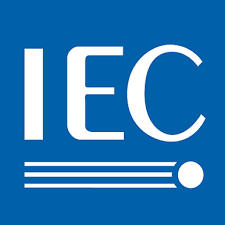
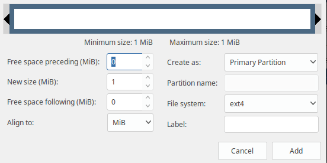

## Tabel Satuan Kapasitas Peyimpanan {#tabel-satuan-kapasitas-peyimpanan}

Tabel Satuan Kapasitas Peyimpanan Data sesuai Tradisional dan Standar IEC dalam satuan (Byte):

| Satuan Byte |
| --- |
| Tabel Tradisional | Tabel Standar IEC |  |  |
| Nama | Simbol | Nama | Simbol | Jumlah Byte (B) | Equal |
| Bit | b | Bit | b | - | - |
| Byte | B | Byte | B | 1 B | - |
| Kilobyte | kB | Kibibyte | KiB | 1,024B | 1024 B |
| Megabyte | MB | Mebibyte | MiB | 1,048,576B | 1024 Kb / KiB |
| Gigabyte | GB | Gibibyte | GiB | 1,073,741,824B | 1024 MB / MiB |
| Terabyte | TB | Tebibyte | TiB | 1,099,511,627,776B | 1024 GB / GiB |
| Petabyte | PB | Pebibyte | PiB | 1,125,899,906,842,624B | 1024 TB / TiB |
| Exabyte | EB | Exbibyte | EiB | 1,152,921,504,606,846,976B | 1024 PB / PiB |
| Zettabyte | ZB | Zebibyte | ZiB | 1,180,591,620,717,411,303,424B | 1024 EB / EiB |
| Yottabyte | YB | Yobibyte | YiB | 1,208,925,819,614,629,174,706,176B | 1024 ZB / ZiB |

Keterangan : Logo IEC

IEC (International Electrotechnical Commission) adalah suatu ornop standardisasi internasional nirlaba yang menyiapkan dan mempublikasikan standar internasional untuk semua teknologi elektrik, elektronika, dan teknologi lain yang terkait, yang secara kolektif dikenal dengan &quot;elektroteknologi&quot;. Standar IEC meliputi berbagai teknologi dari pembangkitan, transmisi, dan distribusi listrik hingga perlengkapan rumah tangga dan perlengkapan kantor, semikonduktor, serat optik, baterai, tenaga surya, nanoteknologi dan tenaga air laut, serta berbagai hal lain. IEC juga mengelola skema penilaian kesesuaian yang menyatakan apakah suatu perangkat, sistem, atau komponen sesuai dengan standar internasional.

Secara Bahasanya sehari hari semisal Memiliki Hardisk Berkapasitas 500 GB atau 500 GiB dalam satuan IEC itu sama dengan 1.000 MiB atau Secara Kasarnya 1.000 MB.

Perlu dicatatat :

*   Tidak Semua aplikasi mengikuti satuan IEC. Hal ini Membuat kebingungan dalam satuan penyimpanan untuk Membedakannya bisa dilihat dalam Keterangannya semisal 1 MB (Tradisional) dan 1 MiB (Sudah Mengikuti IEC).

*   Pada aplikasi Gparted bahasan install ini satuannya tertera MiB sudah mengiktui aturan Standar IEC.

Keterangan : Tampilan Jendela Gparted aplikasi Manager Partisi di GNU/Linux.