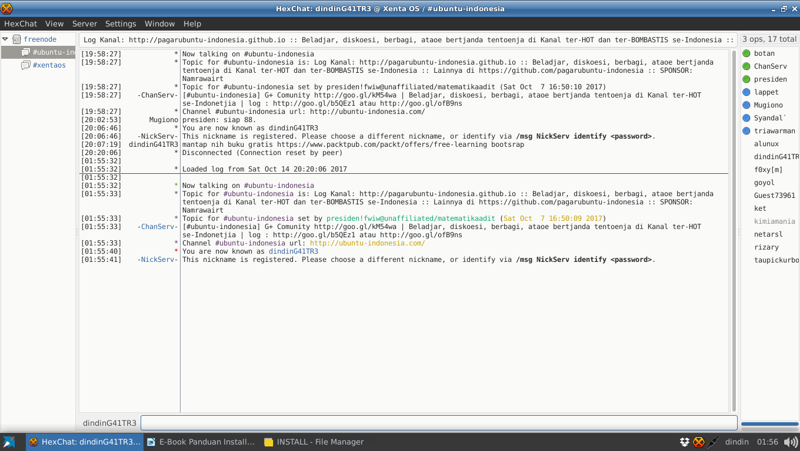

## IRC {#irc}

IRC sebenarnya adalah teknologi lama untuk chatting pada sebuah kanal ( mudahnya : sebuah room). Pada linux, terdapat banyak sekali aplikasi yang dapat digunakan untuk terkoneksi pada server IRC.

### Group Diskusi Topik FOSS &amp; GNU/Linux {#group-diskusi-topik-foss-gnu-linux}

Group Komunitas dan Ngobrol santai di kanal super seru IRC membahas topik berkaitan dengan open source dan GNU/Linux.

| Server IRC | Channel |
| --- | --- |
| irc.freenode.net | #ubuntu-indonesia |

Keterangan :